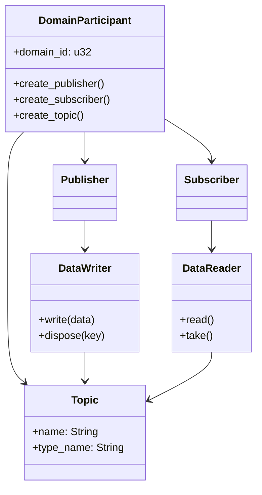

# API Reference

HDDS provides native bindings for multiple programming languages. Each binding is designed to feel idiomatic in its target language while maintaining consistent DDS semantics.

## Supported Languages

| Language | Package | Documentation |
|----------|---------|---------------|
| **Rust** | `hdds` | [Rust API](../api/rust.md) |
| **C** | `libhdds` | [C API](../api/c.md) |
| **C++** | `hdds-cpp` | [C++ API](../api/cpp.md) |
| **Python** | `hdds` | [Python API](../api/python.md) |

## Quick Reference

### Creating a Participant

import Tabs from '@theme/Tabs';
import TabItem from '@theme/TabItem';

<Tabs>
  <TabItem value="rust" label="Rust" default>

```rust
use hdds::{Participant, TransportMode};

let participant = Participant::builder("my_app")
    .domain_id(0)
    .with_transport(TransportMode::UdpMulticast)
    .build()?;
```

  </TabItem>
  <TabItem value="c" label="C">

```c
struct HddsParticipant *participant =
    hdds_participant_create_with_transport("my_app", UDP_MULTICAST);
```

  </TabItem>
  <TabItem value="cpp" label="C++">

```cpp
hdds::Participant participant("my_app");
```

  </TabItem>
  <TabItem value="python" label="Python">

```python
with hdds.Participant("my_app") as participant:
    # use participant
    pass
```

  </TabItem>
</Tabs>

### Creating a Writer

<Tabs>
  <TabItem value="rust" label="Rust" default>

```rust
let writer = participant
    .topic::<Temperature>("sensors/temp")?
    .writer()
    .qos(QoS::reliable())
    .build()?;
```

  </TabItem>
  <TabItem value="c" label="C">

```c
struct HddsQoS *qos = hdds_qos_reliable();
struct HddsDataWriter *writer =
    hdds_writer_create_with_qos(participant, "sensors/temp", qos);
hdds_qos_destroy(qos);
```

  </TabItem>
  <TabItem value="cpp" label="C++">

```cpp
auto qos = hdds::QoS::reliable().transient_local();
auto writer = participant.create_writer_raw("sensors/temp", qos);
```

  </TabItem>
  <TabItem value="python" label="Python">

```python
qos = hdds.QoS.reliable().transient_local()
writer = participant.create_writer("sensors/temp", qos=qos)
```

  </TabItem>
</Tabs>

### Writing Data

<Tabs>
  <TabItem value="rust" label="Rust" default>

```rust
let sample = Temperature { sensor_id: 1, value: 23.5 };
writer.write(&sample)?;
```

  </TabItem>
  <TabItem value="c" label="C">

```c
// Raw bytes (use hdds_gen for typed data)
const char *msg = "Hello DDS";
hdds_writer_write(writer, msg, strlen(msg));
```

  </TabItem>
  <TabItem value="cpp" label="C++">

```cpp
std::vector<uint8_t> data = {1, 2, 3, 4};
writer->write_raw(data);
```

  </TabItem>
  <TabItem value="python" label="Python">

```python
writer.write(b"Hello DDS")
```

  </TabItem>
</Tabs>

### Reading Data

<Tabs>
  <TabItem value="rust" label="Rust" default>

```rust
while let Some(sample) = reader.try_take()? {
    println!("Received: {:?}", sample);
}
```

  </TabItem>
  <TabItem value="c" label="C">

```c
char buffer[1024];
size_t len;
while (hdds_reader_take(reader, buffer, sizeof(buffer), &len) == OK) {
    // process buffer (len bytes)
}
```

  </TabItem>
  <TabItem value="cpp" label="C++">

```cpp
while (auto data = reader->take_raw()) {
    // process *data (std::vector<uint8_t>)
}
```

  </TabItem>
  <TabItem value="python" label="Python">

```python
while (data := reader.take()) is not None:
    print(f"Received: {data}")
```

  </TabItem>
</Tabs>

## Core Entities

All DDS implementations share the same core entities:



## Feature Comparison

| Feature | Rust | C | C++ | Python |
|---------|------|---|-----|--------|
| Typed Data | `#[derive(DDS)]` | hdds_gen | hdds_gen | hdds_gen |
| Raw Bytes | Yes | Yes | Yes | Yes |
| Fluent QoS | Yes | No | Yes | Yes |
| RAII | Yes | Manual | Yes | Context Mgr |
| WaitSet | Yes | Yes | Yes | Yes |
| Telemetry | Yes | Yes | Yes | Yes |
| Async/Await | Planned | No | No | Planned |
| Listeners | Planned | Planned | Planned | Planned |
