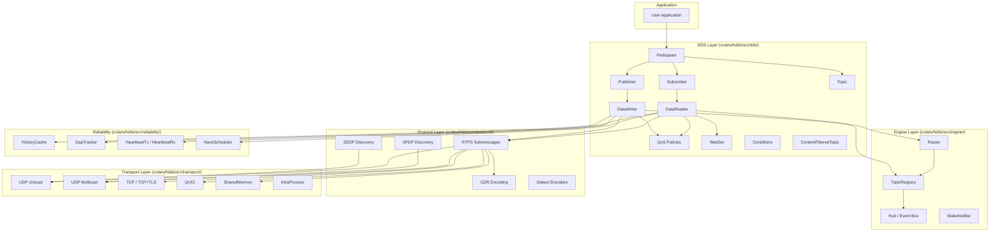
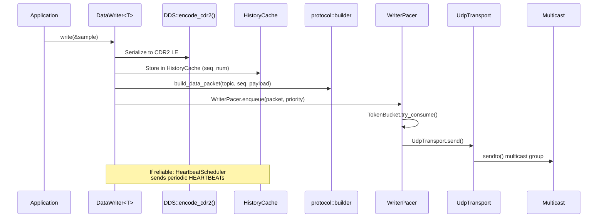
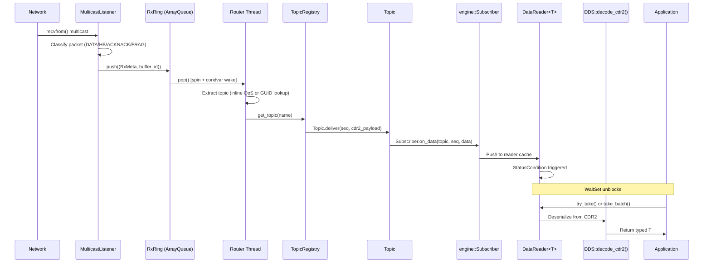
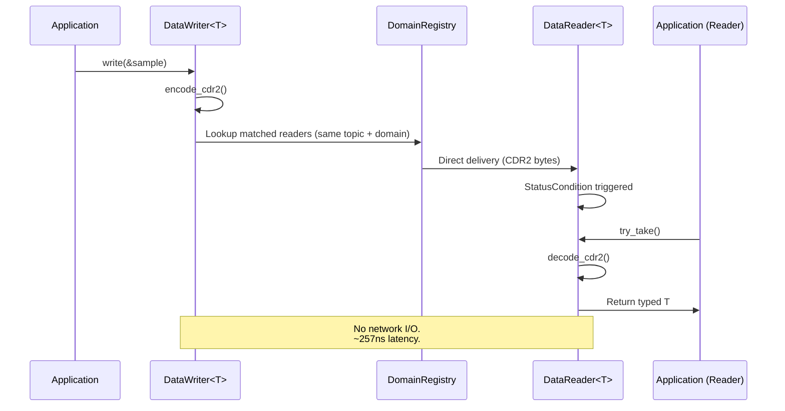
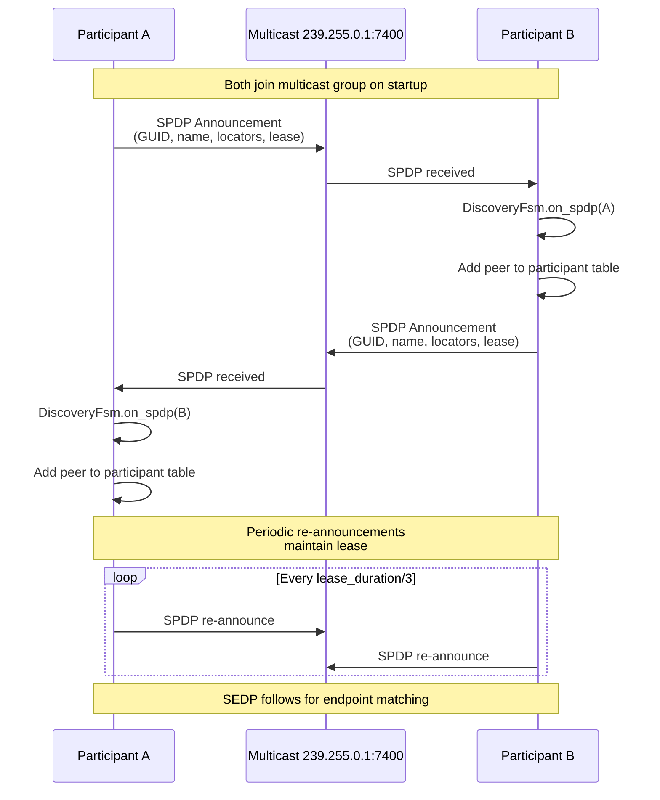
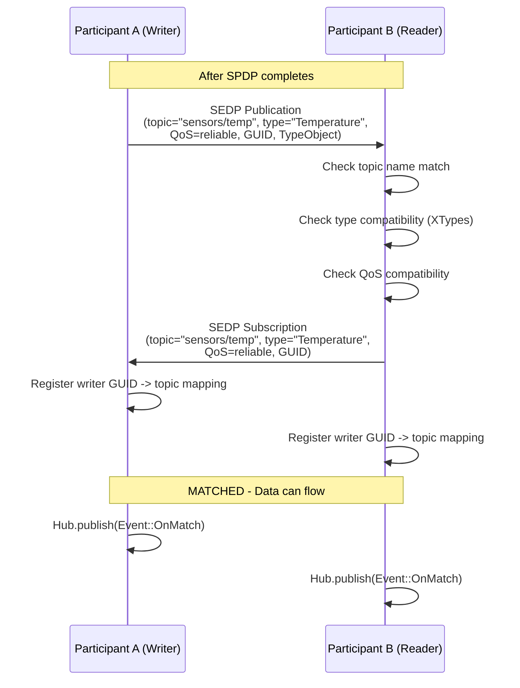

# HDDS Internal Architecture

> Version 1.0.5 | Last updated: 2026-02-13

This document describes the internal architecture of HDDS (High-performance Data Distribution Service), a pure Rust implementation of the OMG DDS and RTPS 2.5 specifications.

---

## 1. High-Level Architecture

HDDS is organized as a layered stack. Each layer depends only on the layers below it.

```
+-----------------------------------------------------------------------+
|                          Application Layer                            |
|   Participant::builder() -> create_writer<T>() / create_reader<T>()  |
+-----------------------------------------------------------------------+
|                            DDS Layer                                  |
|   QoS Policies | Topic Management | WaitSet | Conditions | Listeners |
+-----------------------------------------------------------------------+
|                           Engine Layer                                |
|   Router | TopicRegistry | Hub (Event Bus) | WakeNotifier            |
+-----------------------------------------------------------------------+
|                          Protocol Layer                               |
|   RTPS Submessages | CDR Encoding | Discovery (SPDP/SEDP) | Dialects|
+-----------------------------------------------------------------------+
|                        Reliability Layer                              |
|   HistoryCache | GapTracker | HeartbeatTx/Rx | NackScheduler         |
+-----------------------------------------------------------------------+
|                     Congestion Control Layer                          |
|   TokenBucket | WriterPacer | WFQ | BudgetAllocator | RateController |
+-----------------------------------------------------------------------+
|                        Transport Layer                                |
|   UDP | Multicast | TCP | TCP+TLS | QUIC | SharedMemory | IntraProcess|
+-----------------------------------------------------------------------+
```



---

## 2. Crate Structure

The workspace contains the following crates, each with a specific responsibility:

| Crate | Path | Purpose |
|-------|------|---------|
| `hdds` | `crates/hdds/` | Core DDS/RTPS implementation (the main library) |
| `hdds-c` | `crates/hdds-c/` | C FFI bindings exposing HDDS to C/C++/Python |
| `hdds-codegen` | `crates/hdds-codegen/` | Proc-macro crate for `#[derive(DDS)]` |
| `rmw-hdds` | `crates/rmw-hdds/` | Safe Rust wrappers for ROS 2 RMW integration |
| `hdds-discovery-server` | `crates/hdds-discovery-server/` | Standalone discovery server binary |
| `hdds-persistence` | `crates/hdds-persistence/` | Durable data storage for transient-local QoS |
| `hdds-recording` | `crates/hdds-recording/` | Topic recording and replay |
| `hdds-gateway` | `crates/hdds-gateway/` | Domain-to-domain gateway |
| `hdds-router` | `crates/hdds-router/` | Standalone routing daemon |
| `hdds-logger` | `crates/hdds-logger/` | Structured logging infrastructure |
| `hdds-micro` | `crates/hdds-micro/` | Minimal DDS for embedded targets |
| `hdds-micro-c` | `crates/hdds-micro-c/` | C bindings for hdds-micro |
| `hdds-telemetry-otlp` | `crates/hdds-telemetry-otlp/` | OpenTelemetry OTLP exporter |
| `hdds-async` | `crates/hdds-async/` | Async (Tokio) wrappers for HDDS |

### Tools (`tools/`)

| Tool | Purpose |
|------|---------|
| `hdds-gen` | IDL compiler (IDL 4.2 to Rust/C/C++/Python) |
| `hddsctl` | CLI management and inspection |
| `hdds-admin` | Admin operations (mesh introspection, snapshots) |
| `hdds-convert-qos` | QoS format conversion (XML/YAML/JSON) |
| `hdds-debugger` | Web-based debugging UI |
| `hdds-ws` | WebSocket bridge for browser clients |
| `hdds-topic-echo` | Topic monitoring (like `ros2 topic echo`) |
| `hdds-latency-probe` | Latency measurement tool |
| `hdds-stress` | Load/stress testing tool |
| `hdds-discovery-dump` | Discovery packet inspector |
| `hdds-shm-viewer` | Shared memory segment inspector |

---

## 3. Core Modules

### 3.1 `dds/` -- DDS API Layer

**Path:** `crates/hdds/src/dds/`

The user-facing DDS API following the OMG DDS 1.4 specification.

| Module | Type | Description |
|--------|------|-------------|
| `participant/` | `Participant` | Entry point. Factory for all DDS entities. Owns transport, discovery, and router. |
| `participant/builder.rs` | `ParticipantBuilder` | Builder pattern for participant configuration. |
| `participant/runtime.rs` | `Participant` (struct) | Runtime state: GUID, transport, registry, discovery FSM, threads. |
| `writer/` | `DataWriter<T>` | Typed publisher. Serializes via `DDS` trait, sends via transport. |
| `writer/heartbeat_scheduler.rs` | `HeartbeatSchedulerHandle` | Periodic HEARTBEAT sending for reliable writers. |
| `writer/nack.rs` | NACK handling | Processes ACKNACK from readers, triggers retransmission. |
| `reader/` | `DataReader<T>` | Typed subscriber. Receives CDR2 data, deserializes via `DDS` trait. |
| `reader/cache.rs` | Sample cache | Local sample storage with history depth. |
| `reader/heartbeat.rs` | HEARTBEAT processing | Gap detection and NACK scheduling on heartbeat. |
| `reader/subscriber.rs` | Engine subscriber | Implements `engine::Subscriber` trait for data delivery. |
| `publisher.rs` | `Publisher` | Grouping entity for writers (QoS propagation). |
| `subscriber.rs` | `Subscriber` | Grouping entity for readers (QoS propagation). |
| `topic.rs` | `Topic` | Named data channel with type and QoS. |
| `waitset.rs` | `WaitSet` | Blocks until conditions trigger. |
| `condition/` | `GuardCondition`, `StatusCondition` | Trigger mechanisms for WaitSet. |
| `read_condition/` | `ReadCondition`, `QueryCondition` | Content-aware triggering. |
| `content_filtered_topic.rs` | `ContentFilteredTopic` | SQL-like filter on incoming samples. |
| `filter/` | `FilterParser`, `FilterEvaluator` | SQL filter expression parser and runtime evaluator. |
| `listener.rs` | Listener traits | Callback-based notifications (`DataReaderListener`, `DataWriterListener`). |
| `domain_registry.rs` | `DomainRegistry`, `DomainState` | Intra-process endpoint matching and auto-binding. |
| `local_registry.rs` | `LocalRegistry` | Per-participant local endpoint registry. |
| `qos/` | QoS policies | All QoS policy definitions (`Reliability`, `Durability`, `Deadline`, etc.). |

**Entity hierarchy:**

```
DomainParticipant
 +-- Publisher
 |    +-- DataWriter<T>  ------> Topic<T>
 +-- Subscriber
      +-- DataReader<T>  <------ Topic<T>
```

### 3.2 `engine/` -- Message Routing Engine

**Path:** `crates/hdds/src/engine/`

The central data routing engine. Receives raw RTPS packets from transports and delivers them to the correct subscribers.

| Module | Type | Description |
|--------|------|-------------|
| `router.rs` | `Router` | Background thread that pops packets from `RxRing` (lock-free ArrayQueue) and routes them via `TopicRegistry`. Handles DATA, DATA_FRAG, HEARTBEAT, ACKNACK, HEARTBEAT_FRAG. |
| `router.rs` | `RouterMetrics` | Lock-free atomic counters: `packets_routed`, `packets_orphaned`, `delivery_errors`, `bytes_delivered`, `nack_frag_requests`, `fragment_timeouts`, `packets_deduplicated`. |
| `router.rs` | `route_data_packet()` | **HOT PATH** function. Attempts inline QoS topic extraction first, falls back to GUID-based routing (SEDP mapping) for RTI/Cyclone/FastDDS interop. |
| `demux.rs` | `TopicRegistry` | Thread-safe (RwLock) topic-to-subscribers mapping. Also maintains `writer_guid_to_topic` map for GUID-based routing. |
| `demux.rs` | `Topic` | Topic metadata + subscriber list with panic-isolated delivery. |
| `hub.rs` | `Hub` | Event bus: MPSC producer to NxSPSC subscriber rings. Broadcasts `Event::OnMatch`, `OnUnmatch`, `OnIncompatibleQos`, `SystemStall`. |
| `subscriber.rs` | `Subscriber` trait, `CallbackSubscriber` | Callback pattern for receiving topic data from the router. |
| `unicast_router.rs` | `route_raw_rtps_message()` | Routes raw RTPS messages arriving via TCP/QUIC unicast connections. |
| `wake.rs` | `WakeNotifier` | Condvar-based notification for sub-microsecond router wake-up (replaces 100us polling). |

**Data flow through the engine:**

```
MulticastListener -> RxRing.push()
      |
      v
Router.pop() -> parse topic name / GUID
      |
      v
TopicRegistry.get_topic()
      |
      v
Topic.deliver() -> Subscriber.on_data()
      |
      v
Hub.publish(Event) -> NxSPSC rings
```

### 3.3 `protocol/` -- RTPS Wire Protocol

**Path:** `crates/hdds/src/protocol/`

Implementation of the RTPS 2.5 wire protocol.

| Module | Description |
|--------|-------------|
| `constants.rs` | RTPS PIDs, entity IDs, vendor IDs, protocol version bytes. |
| `cdr.rs` | CDR (Common Data Representation) encoding helpers. |
| `rtps/` | **Vendor-neutral** RTPS submessage encoders. |
| `rtps/data.rs` | `encode_data()`, `encode_data_frag()` -- DATA (0x15) and DATA_FRAG (0x16). |
| `rtps/acknack.rs` | `encode_acknack()` -- ACKNACK (0x06) positive/negative acknowledgment. |
| `rtps/heartbeat.rs` | `encode_heartbeat()` -- HEARTBEAT (0x07) writer liveness. |
| `rtps/gap.rs` | `encode_gap()` -- GAP (0x08) irrelevant sequences. |
| `rtps/info.rs` | `encode_info_dst()`, `encode_info_ts()` -- INFO_DST (0x0E), INFO_TS (0x09). |
| `rtps/locator.rs` | Locator encoding for unicast/multicast addresses. |
| `builder/` | High-level packet construction (`build_data_packet`, `extract_inline_qos`, `extract_writer_guid`, `extract_sequence_number`). |
| `builder/nack_frag.rs` | NACK_FRAG packet builder for fragment repair requests. |
| `builder/heartbeat_frag.rs` | HEARTBEAT_FRAG packet builder. |
| `discovery/` | SPDP and SEDP protocol parsers and builders. |
| `discovery/spdp/` | Simple Participant Discovery Protocol -- build and parse SPDP announcements. |
| `discovery/sedp/` | Simple Endpoint Discovery Protocol -- build and parse endpoint publications/subscriptions. |
| `dialect/` | Vendor-specific encoding overrides for multi-vendor interoperability. |

**Supported vendor dialects:**

| Dialect | Module | Status |
|---------|--------|--------|
| FastDDS | `dialect/fastdds/` | Full |
| RTI Connext | `dialect/rti/` | Full |
| CycloneDDS | `dialect/cyclone/` | Full |
| OpenDDS | `dialect/opendds/` | Full |
| HDDS Native | `dialect/hdds/` | Full |
| OpenSplice | `dialect/opensplice/` | Legacy |
| CoreDX | `dialect/coredx/` | Legacy |
| Gurum | `dialect/gurum/` | Partial |
| InterCOM | `dialect/intercom/` | Partial |

**Architectural constraint:**

```
ALLOWED:   dialect::* -> protocol::rtps::*
FORBIDDEN: protocol::rtps -> dialect::*
```

### 3.4 `transport/` -- Transport Layer

**Path:** `crates/hdds/src/transport/`

Network transports for RTPS communication.

| Module | Type | Description |
|--------|------|-------------|
| `udp.rs` | `UdpTransport` | UDP unicast socket management, `send()`, `send_to_endpoint()`. |
| `multicast.rs` | Multicast | Multicast group joining, interface discovery, multicast listener threads. |
| `ports.rs` | `PortMapping` | RTPS v2.5 port number calculation (domain_id + participant_id -> ports). |
| `tcp/` | `TcpTransport` | TCP transport with connection manager, frame codec, byte stream framing. |
| `tcp/tls.rs` | TLS | TCP+TLS via rustls (ServerConnection/ClientConnection). |
| `tcp/io_thread.rs` | I/O thread | mio event loop for non-blocking TCP/TLS I/O. |
| `tcp/connection_manager.rs` | Connection manager | Tracks pending/active connections, GUID extraction from RTPS headers. |
| `quic/` | `QuicTransport` | QUIC transport (feature-gated) for NAT traversal and connection migration. |
| `quic/io_thread.rs` | Sync wrapper | Background thread with mini tokio runtime for sync API access. |
| `shm/` | `ShmSegment`, `ShmRingWriter`, `ShmRingReader` | Linux shared memory transport. Lock-free ring buffer with futex notifications. Zero-copy inter-process communication. |
| `shm/policy.rs` | `ShmPolicy` | Transport selection: `Prefer` / `Require` / `Disable`. |
| `tsn/` | `TsnConfig` | Time-Sensitive Networking for deterministic Ethernet (SO_TXTIME). |
| `lowbw/` | `LowBwConfig` | Low bandwidth transport for constrained links (LoRa, satellite). LZ4 compression. |
| `mobility/` | IP mobility | Network handover detection and locator tracking. |
| `dscp.rs` | `DscpConfig` | Differentiated Services Code Point for traffic classification. |
| `filter.rs` | `NetworkFilter` | IP-based packet filtering (whitelist/blacklist). |
| `ttl.rs` | `TtlConfig` | IP Time-To-Live configuration. |

### 3.5 `discovery/` -- Discovery Mechanisms

**Path:** `crates/hdds/src/discovery/`

Higher-level discovery backends beyond the built-in SPDP/SEDP.

| Module | Description |
|--------|-------------|
| `cloud/aws.rs` | AWS Cloud Map service discovery. |
| `cloud/azure.rs` | Azure Service Discovery. |
| `cloud/consul.rs` | HashiCorp Consul service discovery. |
| `cloud/poller_thread.rs` | Sync wrapper: background thread with mini tokio runtime. Auto-started via `.with_consul()`. |
| `k8s.rs` | Kubernetes DNS-based discovery (Headless Services). Zero external dependencies. |

The core SPDP/SEDP implementation lives in `crates/hdds/src/core/discovery/` (the `core` module), not in `discovery/`.

### 3.6 `reliability/` -- Reliable Protocol

**Path:** `crates/hdds/src/reliability/`

RTPS reliability protocol implementation (RTPS v2.5 Section 8.4).

| Module | Type | Description |
|--------|------|-------------|
| `history_cache.rs` | `HistoryCache` | Writer-side sample storage for retransmission. Bounded by `KEEP_LAST(depth)`. |
| `gap_tracker.rs` | `GapTracker` | Reader-side sequence number gap detection. |
| `messages.rs` | `HeartbeatMsg`, `NackMsg`, `GapMsg`, `InfoDstMsg`, `InfoTsMsg` | RTPS reliability message types with serialization. |
| `rtps_range.rs` | `RtpsRange` | Sequence number range operations (bitmap-based). |
| `seq.rs` | `SeqNumGenerator` | Monotonic sequence number generator. |
| `writer.rs` | `HeartbeatTx`, `GapTx`, `WriterRetransmitHandler` | Writer-side reliability: periodic heartbeats, gap announcements, retransmission on NACK. |
| `reader.rs` | `HeartbeatRx`, `NackScheduler`, `ReaderRetransmitHandler` | Reader-side reliability: heartbeat processing, NACK generation, retransmit handling. |
| `metrics.rs` | `ReliableMetrics` | Counters: heartbeats sent, NACKs sent, retransmits, gaps detected, out-of-order. |

**Reliable delivery flow:**

```
Writer                                    Reader
  |                                          |
  |--- DATA (seq=1) ------------------------>|
  |--- DATA (seq=2) ----------X (lost)       |
  |--- DATA (seq=3) ------------------------>|
  |                                          |
  |--- HEARTBEAT (first=1, last=3) -------->|
  |                                          | (detects gap: seq=2 missing)
  |<-- ACKNACK (missing: [2]) --------------|
  |                                          |
  |--- DATA (seq=2) [retransmit] ---------->|
  |                                          | (gap filled)
```

### 3.7 `security/` -- DDS Security

**Path:** `crates/hdds/src/security/`

DDS Security v1.1 plugin architecture (feature-gated: `security`).

| Module | Type | Description |
|--------|------|-------------|
| `mod.rs` | `SecurityPluginSuite` | Holds all 4 plugins. Attached to `Participant` at creation. |
| `config.rs` | `SecurityConfig`, `SecurityConfigBuilder` | Builder for security configuration (certs, keys, permissions). |
| `authentication.rs` | `AuthenticationPlugin` trait | X.509 certificate-based identity verification. |
| `auth/x509.rs` | X.509 parsing | Certificate chain validation. |
| `auth/handshake.rs` | DDS-Security handshake | Challenge-response authentication protocol. |
| `auth/identity_token.rs` | Identity tokens | Identity representation for SPDP. |
| `access/permissions.rs` | Permissions | XML-based topic/partition access rules. |
| `access_control.rs` | `AccessControlPlugin` | Governance + permissions enforcement. |
| `crypto/aes_gcm.rs` | AES-256-GCM | Data encryption/decryption. |
| `crypto/key_exchange.rs` | ECDH | Diffie-Hellman key exchange. |
| `crypto/session_keys.rs` | Key derivation | Session key management. |
| `cryptographic.rs` | `CryptoPlugin` | Encryption/decryption operations. |
| `audit/` | `LoggingPlugin` | ANSSI-compliant hash-chain audit trail. |
| `logging.rs` | Security logging | Security event logging infrastructure. |

**Plugin architecture:**

```
SecurityPluginSuite
 +-- AuthenticationPlugin  (X.509 certificate validation)
 +-- AccessControlPlugin   (Permissions XML enforcement)
 +-- CryptographicPlugin   (AES-256-GCM encryption)
 +-- LoggingPlugin         (Audit trail + hash-chain)
```

### 3.8 `xtypes/` -- Type System

**Path:** `crates/hdds/src/xtypes/`

XTypes v1.3 support for runtime type discovery and compatibility checking.

| Module | Description |
|--------|-------------|
| `type_id.rs` | `TypeIdentifier` -- Type identification (TK_FLOAT32, TK_INT32, etc.). |
| `type_kind.rs` | `TypeKind` -- Classification of types. |
| `equivalence.rs` | Type compatibility checking (structural equivalence). |
| `type_object/` | `CompleteTypeObject` -- Full type definition for SEDP announcements. |
| `cdr2/` | CDR2 encoding for all XTypes types (primitives, strings, collections, structs, unions, enums, bitsets, aliases, annotations). |
| `builder/` | Type builders including `rosidl_message_type_support_t` for ROS 2 integration. |

### 3.9 `congestion/` -- Congestion Control

**Path:** `crates/hdds/src/congestion/`

Adaptive congestion control to prevent network collapse.

| Module | Type | Description |
|--------|------|-------------|
| `controller.rs` | `CongestionController` | Central orchestrator: scorer + rate controller + budget allocator. |
| `token_bucket.rs` | `TokenBucket` | Per-writer token bucket rate limiter. |
| `writer_pacer.rs` | `WriterPacer` | Priority queues (P0/P1/P2) with token-bucket gating. |
| `rate_controller.rs` | `RateController` | AIMD (Additive Increase / Multiplicative Decrease) rate adaptation. |
| `rtt_estimator.rs` | `RttEstimator` | Round-trip time estimation (EWMA). |
| `scorer.rs` | `CongestionScorer` | Congestion state scoring (EWMA-based). |
| `budget_allocator.rs` | `BudgetAllocator` | Per-writer budget allocation with P0 reserve. |
| `coalescing.rs` | `CoalescingQueue` | P2 "last value wins" coalescing by instance key. |
| `nack_coalescer.rs` | `NackCoalescer` | NACK batching to reduce repair storms. |
| `repair_queue.rs` | `RepairQueue` | Repair scheduling with budget limiting. |
| `retry_tracker.rs` | `RetryTracker` | Exponential backoff retry logic. |
| `wfq.rs` | `WfqScheduler`, `PriorityWfqScheduler` | Weighted Fair Queuing for multi-writer scheduling. |
| `ecn.rs` | `EcnProcessor` | Explicit Congestion Notification support. |
| `transport_feedback.rs` | `TransportFeedback` | Network signal classification (EAGAIN, timeouts). |

**Priority semantics:**

- **P0 (Critical):** Never dropped, can bypass rate limit.
- **P1 (Normal):** Drops oldest when queue full.
- **P2 (Background):** Coalesced by instance key, "last value wins".

---

## 4. Data Flow

### 4.1 Write Path (Publisher to Network)



### 4.2 Read Path (Network to Subscriber)



### 4.3 Intra-Process Path

When both writer and reader are in the same process with `TransportMode::IntraProcess`:



---

## 5. Thread Model

HDDS spawns several background threads depending on configuration. All threads are cleanly joined on `Participant::drop()`.

| Thread | Spawned By | Purpose | Lifetime |
|--------|-----------|---------|----------|
| **Router** | `Participant::build()` | Pops packets from `RxRing`, routes via `TopicRegistry` | Participant lifetime |
| **MulticastListener** (N) | `Participant::build()` | One per multicast/unicast socket. `recvfrom()` loop, pushes to `RxRing` | Participant lifetime |
| **SPDP Announcer** | `Participant::build()` | Periodic SPDP announcement broadcast | Participant lifetime |
| **Lease Tracker** | `Participant::build()` | Monitors participant leases, removes expired peers | Participant lifetime |
| **Control Handler** | `Participant::build()` | Two-Ring HEARTBEAT/ACKNACK processing | Participant lifetime |
| **Heartbeat Scheduler** | `DataWriter::new()` | Sends periodic HEARTBEATs for reliable writers | Writer lifetime |
| **Telemetry Collector** | `Participant::build()` | Metrics aggregation and export | Participant lifetime |
| **TCP I/O Thread** | `Participant::build()` (if TCP) | mio event loop for TCP/TLS connections | Participant lifetime |
| **QUIC I/O Thread** | `Participant::build()` (if QUIC) | Mini tokio runtime for quinn QUIC connections | Participant lifetime |
| **Cloud Discovery Poller** | `Participant::build()` (if cloud) | Mini tokio runtime for Consul/AWS/Azure polling | Participant lifetime |
| **K8s DNS Poller** | `Participant::build()` (if k8s) | DNS SRV query loop for Kubernetes discovery | Participant lifetime |
| **Unicast Routing Thread** | `Participant::build()` (if TCP/QUIC) | Routes TCP/QUIC incoming messages to TopicRegistry | Participant lifetime |

**Router thread wake strategy (v211):**

```
1. Fast path: immediate ring.pop()
2. Spin phase: 200 iterations of spin_loop() + ring.pop()
3. Sleep phase: WakeNotifier condvar (10ms timeout) or poll (100us)
```

This achieves sub-10 microsecond wake latency when `WakeNotifier` is available.

---

## 6. Discovery

### 6.1 SPDP (Simple Participant Discovery Protocol)



### 6.2 SEDP (Simple Endpoint Discovery Protocol)



---

## 7. Configuration

HDDS supports configuration via:

1. **Builder API** -- `Participant::builder("name").domain_id(0).build()`
2. **Environment variables** -- `HDDS_DOMAIN_ID`, `HDDS_LOG_LEVEL`, `HDDS_ROUTE_UNKNOWN_WRITER_TO_SINGLE_TOPIC`
3. **XML/YAML QoS files** -- Loaded via `qos-loaders` feature
4. **Config files** -- `configs/` directory with TOML/YAML profiles

### Feature Flags

| Feature | Default | Description |
|---------|---------|-------------|
| `xtypes` | yes | XTypes v1.3 type discovery |
| `type-lookup` | yes | Auto type lookup during discovery |
| `security` | no | DDS Security v1.1 |
| `quic` | no | QUIC transport (NAT traversal) |
| `tcp-tls` | no | TLS for TCP transport |
| `k8s` | no | Kubernetes DNS discovery |
| `cloud-discovery` | no | AWS/Azure/Consul discovery |
| `rpc` | no | DDS-RPC request/reply |
| `qos-loaders` | no | XML/YAML QoS file loading |
| `lowbw-lz4` | yes | LZ4 compression for low bandwidth |
| `dynamic-types` | no | Runtime type manipulation |
