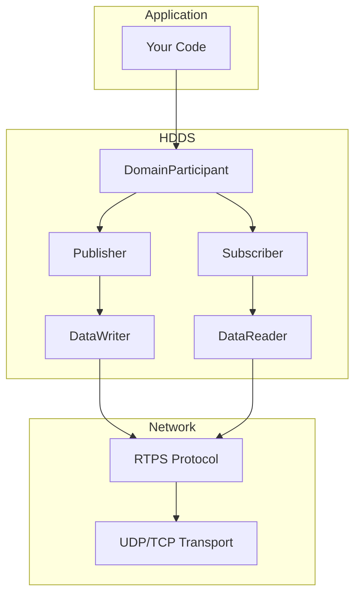

# Getting Started with HDDS

Welcome to HDDS, a high-performance DDS (Data Distribution Service) middleware written in pure Rust. This guide will help you get started quickly.

## Quick Start

import Tabs from '@theme/Tabs';
import TabItem from '@theme/TabItem';

<Tabs>
  <TabItem value="rust" label="Rust" default>

```bash
# Add HDDS to your Cargo.toml
cargo add hdds
```

```rust
use hdds::{Participant, TransportMode, Result};

fn main() -> Result<()> {
    // Create a participant on domain 0
    let participant = Participant::builder("my_app")
        .domain_id(0)
        .with_transport(TransportMode::UdpMulticast)
        .build()?;

    // Create a topic
    let topic = participant.create_topic::<Temperature>("sensor/temp")?;

    // Create a publisher and write data
    let writer = participant.create_writer(&topic)?;
    writer.write(&Temperature { value: 23.5 })?;

    Ok(())
}
```

  </TabItem>
  <TabItem value="c" label="C">

```bash
# Install via apt (Ubuntu/Debian)
sudo apt install libhdds-dev
```

```c
#include <hdds/hdds.h>

int main() {
    hdds_participant_t* participant = hdds_participant_create(0, NULL);
    hdds_topic_t* topic = hdds_topic_create(participant, "sensor/temp", "Temperature");
    hdds_writer_t* writer = hdds_writer_create(participant, topic, NULL);

    Temperature data = { .value = 23.5 };
    hdds_writer_write(writer, &data);

    return 0;
}
```

  </TabItem>
  <TabItem value="python" label="Python">

```bash
pip install hdds
```

```python
import hdds

participant = hdds.DomainParticipant(domain_id=0)
topic = participant.create_topic("sensor/temp", Temperature)
writer = participant.create_writer(topic)

writer.write(Temperature(value=23.5))
```

  </TabItem>
</Tabs>

## What's Next?

<div className="row">
  <div className="col col--4">
    <div className="card">
      <div className="card__header">
        <h3>Learn the Basics</h3>
      </div>
      <div className="card__body">
        <p>Understand DDS concepts and RTPS protocol fundamentals.</p>
      </div>
      <div className="card__footer">
        <a href="/getting-started/what-is-dds" className="button button--primary button--block">What is DDS?</a>
      </div>
    </div>
  </div>
  <div className="col col--4">
    <div className="card">
      <div className="card__header">
        <h3>Install HDDS</h3>
      </div>
      <div className="card__body">
        <p>Get HDDS installed on Linux, macOS, or Windows.</p>
      </div>
      <div className="card__footer">
        <a href="/getting-started/installation/linux" className="button button--primary button--block">Installation Guide</a>
      </div>
    </div>
  </div>
  <div className="col col--4">
    <div className="card">
      <div className="card__header">
        <h3>Build Something</h3>
      </div>
      <div className="card__body">
        <p>Follow our step-by-step Hello World tutorial.</p>
      </div>
      <div className="card__footer">
        <a href="/getting-started/hello-world-rust" className="button button--primary button--block">Hello World</a>
      </div>
    </div>
  </div>
</div>

## Why HDDS?

| Feature | HDDS | FastDDS | CycloneDDS | RTI Connext |
|---------|------|---------|------------|-------------|
| **Language** | Pure Rust | C++ | C | C/C++ |
| **Memory Safety** | Guaranteed | Manual | Manual | Manual |
| **Latency** | Sub-microsecond | ~1-5 µs | ~2-10 µs | ~1-5 µs |
| **Zero-copy** | Yes | Partial | Partial | Yes |
| **Multi-language** | Rust, C, C++, Python | C++, Python | C, Python | C, C++, Java, C#, Python |
| **License** | Apache 2.0 | Apache 2.0 | Eclipse 2.0 | Commercial |

## Architecture Overview


