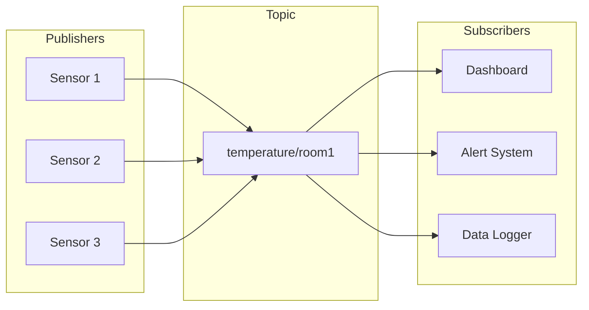
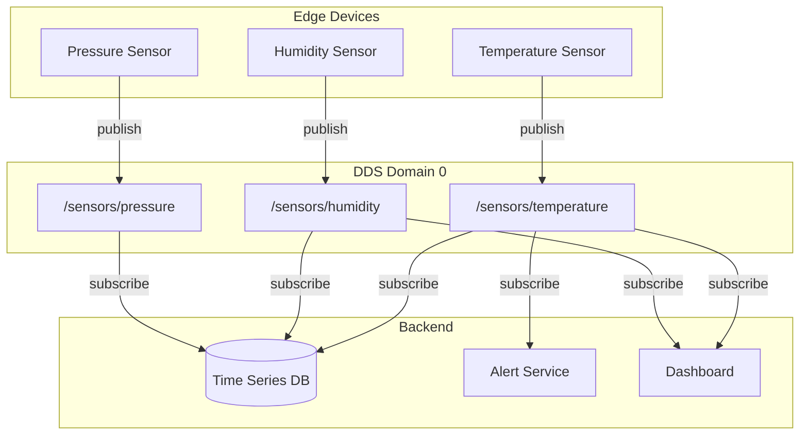

# What is DDS?

**DDS** (Data Distribution Service) is an OMG (Object Management Group) standard for data-centric publish-subscribe middleware. It provides a framework for real-time, scalable, and reliable data exchange between distributed applications.

## The Publish-Subscribe Pattern

Unlike traditional request-response architectures (like HTTP or gRPC), DDS uses a **publish-subscribe** pattern where:

- **Publishers** send data without knowing who receives it
- **Subscribers** receive data without knowing who sends it
- A **Topic** connects publishers and subscribers with matching interests



## Core Concepts

### Domain

A **Domain** is an isolated communication space identified by a numeric ID (0-232). Participants in the same domain can discover and communicate with each other.

```rust
use hdds::{Participant, TransportMode};

// Two participants on the same domain can communicate
let participant1 = Participant::builder("app1")
    .domain_id(0)
    .with_transport(TransportMode::UdpMulticast)
    .build()?;

let participant2 = Participant::builder("app2")
    .domain_id(0)
    .with_transport(TransportMode::UdpMulticast)
    .build()?;

// This participant is isolated from the others (different domain)
let isolated = Participant::builder("isolated")
    .domain_id(42)
    .with_transport(TransportMode::UdpMulticast)
    .build()?;
```

### Participant (DomainParticipant)

The **Participant** is your entry point to DDS. It:

- Joins a domain
- Handles discovery
- Creates publishers, subscribers, and topics

### Topic

A **Topic** is a named channel for a specific data type. Topics have:

- **Name**: A string identifier (e.g., `sensor/temperature`)
- **Type**: The data structure being published
- **QoS**: Quality of Service policies

```rust
#[derive(Topic, Serialize, Deserialize)]
struct Temperature {
    #[key]
    sensor_id: String,
    value: f32,
    timestamp: u64,
}

let topic = participant.create_topic::<Temperature>("sensor/temperature")?;
```

### Publisher / DataWriter

A **Publisher** groups DataWriters with common QoS. A **DataWriter** writes data samples to a topic.

```rust
let publisher = participant.create_publisher()?;
let writer = publisher.create_writer(&topic)?;

writer.write(&Temperature {
    sensor_id: "room1".into(),
    value: 23.5,
    timestamp: now(),
})?;
```

### Subscriber / DataReader

A **Subscriber** groups DataReaders with common QoS. A **DataReader** reads data samples from a topic.

```rust
let subscriber = participant.create_subscriber()?;
let reader = subscriber.create_reader(&topic)?;

// Wait for data
while let Some(sample) = reader.take()? {
    println!("Received: {} = {}°C", sample.sensor_id, sample.value);
}
```

## Quality of Service (QoS)

DDS provides fine-grained control over data distribution through **QoS policies**:

| Policy | Description |
|--------|-------------|
| **Reliability** | BEST_EFFORT (fast) vs RELIABLE (guaranteed delivery) |
| **Durability** | What happens to data before subscribers join |
| **History** | How many samples to keep |
| **Deadline** | Maximum time between updates |
| **Liveliness** | How to detect failed participants |
| **Ownership** | Who owns an instance when multiple writers exist |

:::tip
Start with the defaults! DDS has sensible defaults. Only change QoS when you have a specific requirement.
:::

## Data-Centric Architecture

DDS is **data-centric**, meaning:

1. **Data is the interface** - You define what data looks like, not how to get it
2. **Automatic discovery** - No need to configure IP addresses or ports
3. **Decoupled systems** - Publishers and subscribers don't know about each other
4. **Location transparency** - Data flows regardless of where applications run

### Example: Sensor Network



## DDS vs Other Technologies

| Feature | DDS | MQTT | Kafka | gRPC |
|---------|-----|------|-------|------|
| **Pattern** | Pub/Sub | Pub/Sub | Pub/Sub | Request/Response |
| **Broker** | None (P2P) | Required | Required | None |
| **Latency** | Sub-µs | ~1ms | ~10ms | ~100µs |
| **QoS** | 22 policies | 3 levels | At-least-once | None |
| **Discovery** | Automatic | Via broker | Via broker | Manual |
| **Real-time** | Yes | No | No | No |
| **Standard** | OMG | OASIS | Confluent | Google |

## When to Use DDS

**Use DDS when you need:**

- Real-time, low-latency data distribution
- Reliable multicast to many subscribers
- Automatic discovery without infrastructure
- Fine-grained QoS control
- Interoperability between vendors

**Consider alternatives when:**

- You need cloud-native message queuing (use Kafka)
- You have battery-constrained IoT devices (use MQTT)
- You need simple request/response (use gRPC)

## Next Steps

Now that you understand DDS concepts, learn about the wire protocol:

- **[What is RTPS?](../getting-started/what-is-rtps.md)** - The protocol that makes DDS work
