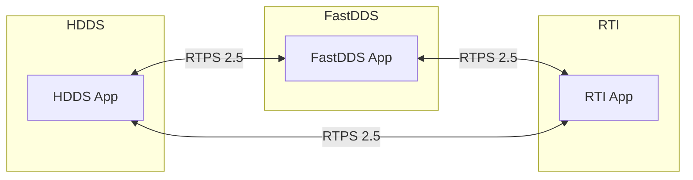
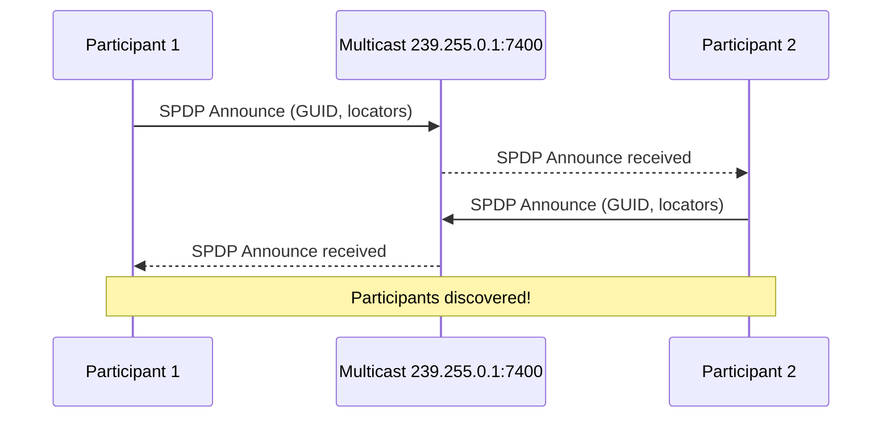
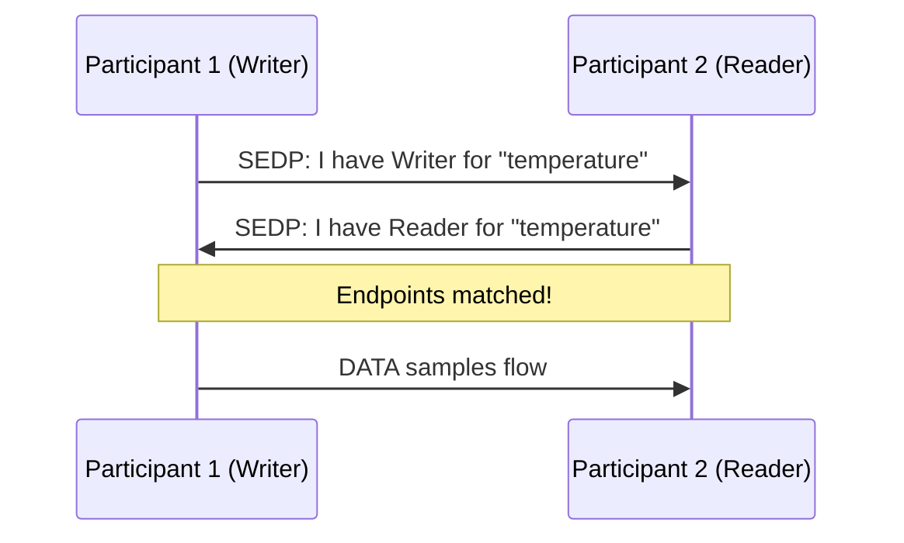
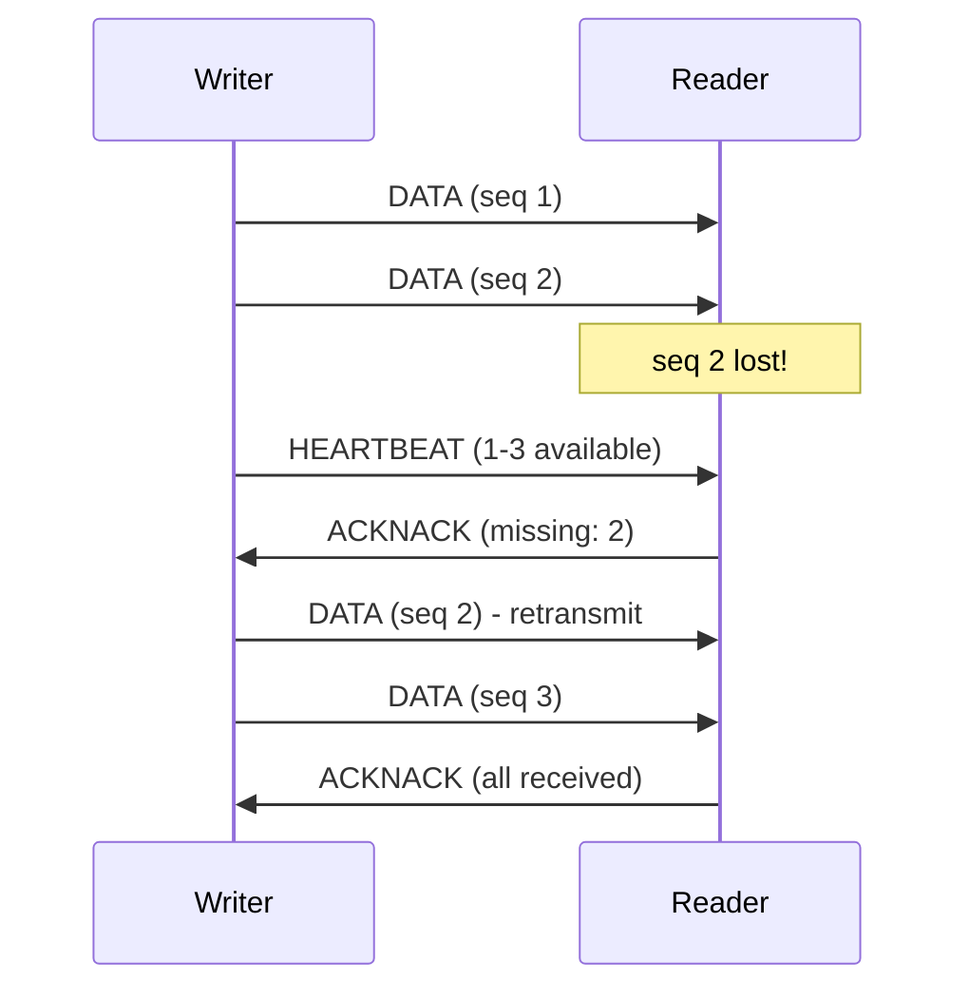

# What is RTPS?

**RTPS** (Real-Time Publish Subscribe) is the wire protocol that enables DDS implementations to communicate with each other. Defined by OMG, it specifies exactly how messages are formatted and exchanged over the network.

## Why RTPS Matters

RTPS is what makes DDS **interoperable**. Any compliant DDS implementation—whether HDDS, FastDDS, CycloneDDS, or RTI Connext—can communicate if they speak the same RTPS version.



## RTPS Versions

| Version | Year | Key Features |
|---------|------|--------------|
| **2.0** | 2008 | Original specification |
| **2.1** | 2010 | Security extensions |
| **2.2** | 2014 | Performance improvements |
| **2.3** | 2019 | Writer liveliness, content filters |
| **2.5** | 2022 | Large data, participant redundancy |

HDDS implements **RTPS 2.5** with backward compatibility to 2.3.

## Protocol Architecture

### Message Structure

Every RTPS message consists of:

```
┌────────────────────────────────────────────────────────┐
│                    RTPS Header                          │
│  ┌──────────┬──────────┬──────────┬─────────────────┐  │
│  │ Protocol │ Version  │ Vendor   │ GuidPrefix      │  │
│  │ "RTPS"   │ 2.5      │ HDDS     │ 12 bytes        │  │
│  └──────────┴──────────┴──────────┴─────────────────┘  │
├────────────────────────────────────────────────────────┤
│                   Submessages                           │
│  ┌────────────────────────────────────────────────┐    │
│  │ Submessage 1 (e.g., DATA)                      │    │
│  └────────────────────────────────────────────────┘    │
│  ┌────────────────────────────────────────────────┐    │
│  │ Submessage 2 (e.g., HEARTBEAT)                 │    │
│  └────────────────────────────────────────────────┘    │
│  ...                                                    │
└────────────────────────────────────────────────────────┘
```

### Submessage Types

| Submessage | Purpose |
|------------|---------|
| **DATA** | Carries user data samples |
| **DATA_FRAG** | Fragmented data for large samples |
| **HEARTBEAT** | Announces available sequence numbers |
| **ACKNACK** | Acknowledges/requests data |
| **GAP** | Indicates missing sequence numbers |
| **INFO_TS** | Provides timestamp information |
| **INFO_DST** | Specifies destination participant |
| **INFO_SRC** | Specifies source participant |

## Discovery Protocol

RTPS defines two discovery protocols:

### SPDP (Simple Participant Discovery Protocol)

Discovers other **participants** in the domain:

1. Each participant sends periodic announcements to a well-known multicast address
2. Announcements include participant GUID, endpoints, and locators
3. Other participants learn about new joiners



### SEDP (Simple Endpoint Discovery Protocol)

Discovers **endpoints** (writers and readers):

1. After participant discovery, endpoints are exchanged via unicast
2. Each participant learns about remote writers/readers
3. Matching (compatible QoS) writers and readers connect



## Port Mapping

RTPS uses a deterministic port mapping based on domain ID:

```
Discovery Multicast Port = 7400 + (250 × domainId)
Discovery Unicast Port   = 7410 + (250 × domainId) + (2 × participantId)
User Multicast Port      = 7401 + (250 × domainId)
User Unicast Port        = 7411 + (250 × domainId) + (2 × participantId)
```

**Example for Domain 0, Participant 0:**

| Port Type | Port Number |
|-----------|-------------|
| Discovery Multicast | 7400 |
| Discovery Unicast | 7410 |
| User Multicast | 7401 |
| User Unicast | 7411 |

:::warning Firewall Configuration
Ensure ports 7400-7500 (and higher for multi-domain) are open for DDS traffic.
:::

## Data Serialization (CDR)

RTPS uses **CDR2** (Common Data Representation) for serialization:

- **Platform-independent** - Works across different CPU architectures
- **Self-describing** - Optional type information included
- **Efficient** - Minimal overhead compared to JSON/XML

```
CDR2 Serialization of Temperature { sensor_id: "room1", value: 23.5 }

┌─────────┬─────────┬─────────┬─────────┬─────────┬─────────┬─────────┬─────────┐
│  0x00   │  0x01   │  0x00   │  0x00   │ 'r'     │ 'o'     │ 'o'     │ 'm'     │
├─────────┼─────────┼─────────┼─────────┼─────────┼─────────┼─────────┼─────────┤
│ '1'     │  0x00   │ padding │ padding │  0x41   │  0xBC   │  0x00   │  0x00   │
└─────────┴─────────┴─────────┴─────────┴─────────┴─────────┴─────────┴─────────┘
  └─ string length ─┘ └── "room1" + null ──┘         └── 23.5 as f32 (LE) ──┘
```

## Reliability Protocol

RTPS implements reliability through:

### Best-Effort

- Fire and forget
- No acknowledgments
- Lowest latency

### Reliable

- HEARTBEAT announces available samples
- ACKNACK requests missing samples
- Retransmission ensures delivery



## RTPS vs Other Protocols

| Feature | RTPS | MQTT | AMQP | ZeroMQ |
|---------|------|------|------|--------|
| **Broker** | None | Required | Required | Optional |
| **Multicast** | Yes | No | No | Yes |
| **QoS** | Rich (22 policies) | 3 levels | Basic | None |
| **Discovery** | Automatic | Manual | Manual | Manual |
| **Real-time** | Yes | No | No | Partial |
| **Standard** | OMG | OASIS | OASIS | None |

## Debugging RTPS

### Using Wireshark

Wireshark has a built-in RTPS dissector:

1. Capture traffic on UDP ports 7400-7500
2. Filter: `rtps`
3. Inspect individual submessages

### Using hdds_viewer

Our [hdds_viewer](https://viewer.hdds.io) tool provides:

- Live RTPS traffic capture
- Message decoding with type information
- Topology visualization
- Latency analysis

## Next Steps

Now you understand how DDS works under the hood. Let's get HDDS installed:

- **[Installation Guide](../getting-started/installation/linux.md)** - Get HDDS on your system
