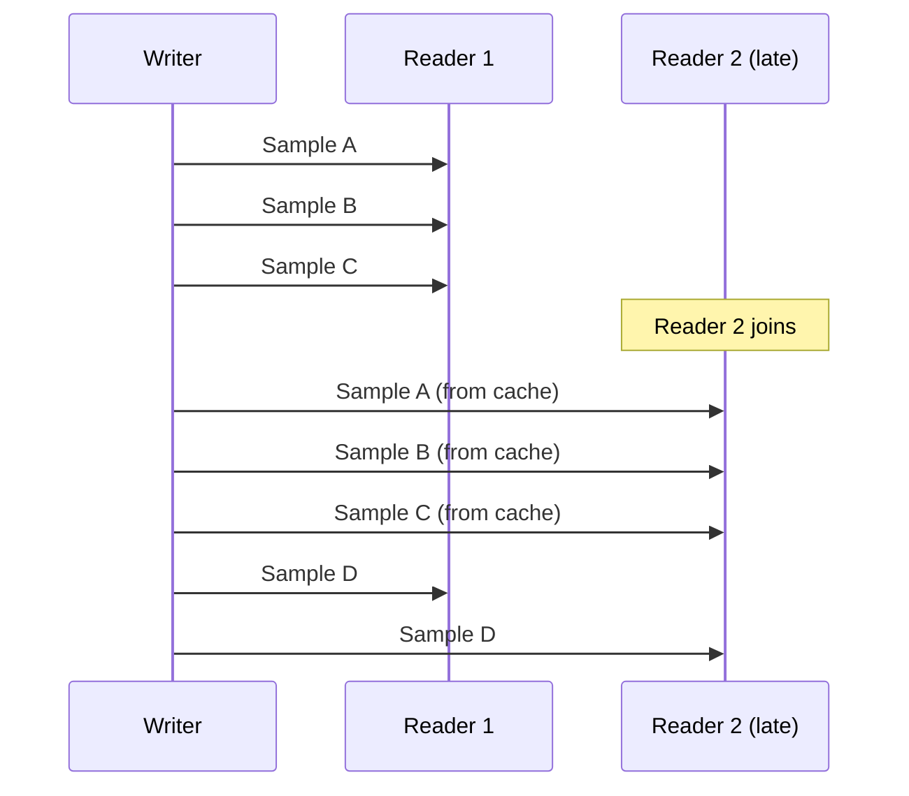

# Durability QoS Policy

The Durability policy controls whether samples are available to late-joining readers.

## Values

| Value | Description | Persistence |
|-------|-------------|-------------|
| `volatile()` | Samples only for connected readers | None |
| `transient_local()` | Writer caches samples for late joiners | In-memory |
| `persistent()` | Samples persisted to disk | Disk |

## Volatile (Default)

Samples are only delivered to readers that are connected when the sample is written.

```rust
use hdds::{Participant, QoS, TransportMode};

let participant = Participant::builder("streaming_app")
    .domain_id(0)
    .with_transport(TransportMode::UdpMulticast)
    .build()?;

let writer = participant
    .topic::<VideoFrame>("video/stream")?
    .writer()
    .qos(QoS::best_effort().volatile())
    .build()?;
```

**Use cases**:
- Real-time sensor data
- Video/audio streaming
- Data where history doesn't matter

## Transient Local

Writers cache samples in memory. Late-joining readers receive cached samples.

```rust
use hdds::{Participant, QoS, TransportMode};

let participant = Participant::builder("config_publisher")
    .domain_id(0)
    .with_transport(TransportMode::UdpMulticast)
    .build()?;

let writer = participant
    .topic::<Configuration>("system/config")?
    .writer()
    .qos(QoS::reliable().keep_last(100).transient_local())
    .build()?;

// Write some samples
writer.write(&config1)?;
writer.write(&config2)?;

// Later, a new reader joins and receives config1, config2
```

**Characteristics**:
- Samples persist as long as writer exists
- Cache size controlled by History policy
- Memory usage = history depth × sample size
- Lost when writer terminates

**Use cases**:
- Configuration/state topics
- Last-known-good values
- Initialization data

## Persistent

Samples are persisted to disk. Survives application restarts.

```rust
use hdds::{Participant, QoS, TransportMode};

let participant = Participant::builder("event_logger")
    .domain_id(0)
    .with_transport(TransportMode::UdpMulticast)
    .build()?;

// Persistent event log survives restarts
let writer = participant
    .topic::<AuditEvent>("audit/events")?
    .writer()
    .qos(QoS::reliable().keep_all().persistent())
    .build()?;
```

**Characteristics**:
- Samples survive writer/application restart
- Higher write latency (disk I/O)
- Disk usage = configured limits

**Use cases**:
- Event logs
- Audit trails
- Mission-critical state

## Compatibility Rules

Durability has an ordered compatibility: writer must offer at least what reader requests.

| Writer | Reader | Match? |
|--------|--------|--------|
| persistent() | persistent() | ✅ Yes |
| persistent() | transient_local() | ✅ Yes |
| persistent() | volatile() | ✅ Yes |
| transient_local() | transient_local() | ✅ Yes |
| transient_local() | volatile() | ✅ Yes |
| transient_local() | persistent() | ❌ No |
| volatile() | volatile() | ✅ Yes |
| volatile() | transient_local() | ❌ No |
| volatile() | persistent() | ❌ No |

**Rule**: `Writer.durability >= Reader.durability`

## Late Joiner Behavior



## Memory Considerations

### Transient Local Memory Usage

```
Memory = history_depth × avg_sample_size × max_instances
```

Example:
- History depth: 100
- Sample size: 1 KB
- Instances: 10
- **Memory: 1 MB**

## Examples

### Configuration Topic

```rust
use hdds::{Participant, QoS, TransportMode};

let participant = Participant::builder("config_server")
    .domain_id(0)
    .with_transport(TransportMode::UdpMulticast)
    .build()?;

// Writer publishes configuration, late joiners get latest
let writer = participant
    .topic::<AppConfig>("system/config")?
    .writer()
    .qos(QoS::reliable().keep_last(1).transient_local())
    .build()?;

// Reader expects to receive current config on join
let reader = participant
    .topic::<AppConfig>("system/config")?
    .reader()
    .qos(QoS::reliable().transient_local())
    .build()?;
```

### Event Log

```rust
use hdds::{Participant, QoS, TransportMode};

let participant = Participant::builder("audit_logger")
    .domain_id(0)
    .with_transport(TransportMode::UdpMulticast)
    .build()?;

// Persistent event log survives restarts
let writer = participant
    .topic::<AuditEvent>("audit/events")?
    .writer()
    .qos(QoS::reliable().keep_all().persistent())
    .build()?;
```

### Volatile Streaming

```rust
use hdds::{Participant, QoS, TransportMode};

let participant = Participant::builder("video_streamer")
    .domain_id(0)
    .with_transport(TransportMode::UdpMulticast)
    .build()?;

// Real-time video stream, no caching needed
let writer = participant
    .topic::<VideoFrame>("video/stream")?
    .writer()
    .qos(QoS::best_effort().keep_last(1).volatile())
    .build()?;
```

## Interaction with History

Durability and History work together:

| Durability | History | Cached Samples |
|------------|---------|----------------|
| volatile() | Any | 0 (no cache) |
| transient_local() | keep_last(N) | Last N samples |
| transient_local() | keep_all() | All samples (bounded by ResourceLimits) |
| persistent() | keep_last(N) | Last N per instance on disk |
| persistent() | keep_all() | All samples on disk |

## Next Steps

- [History](../../guides/qos-policies/history.md) - Sample buffering configuration
- [Reliability](../../guides/qos-policies/reliability.md) - Delivery guarantees
