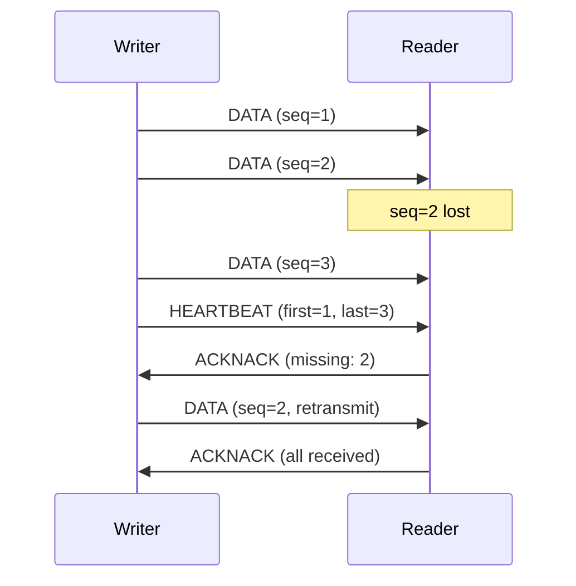

# Reliability QoS Policy

The Reliability policy controls whether data delivery is guaranteed or best-effort.

## Values

| Value | Description | Use Case |
|-------|-------------|----------|
| `best_effort()` | Fire and forget, no retransmission | Sensor data, video streaming |
| `reliable()` | Guaranteed delivery with ACK/NACK | Commands, state synchronization |

## Best Effort

Samples are sent once without acknowledgment. If a sample is lost due to network issues, it is not retransmitted.

```rust
use hdds::{Participant, QoS, TransportMode};

let participant = Participant::builder("sensor_app")
    .domain_id(0)
    .with_transport(TransportMode::UdpMulticast)
    .build()?;

let writer = participant
    .topic::<SensorData>("sensors/temperature")?
    .writer()
    .qos(QoS::best_effort())
    .build()?;
```

**Characteristics**:
- Lowest latency (no ACK overhead)
- No blocking on write
- Samples may be lost
- No memory accumulation for retransmission

## Reliable

Samples are acknowledged by readers. Lost samples trigger NACK-based retransmission.

```rust
use hdds::{Participant, QoS, TransportMode};

let participant = Participant::builder("command_app")
    .domain_id(0)
    .with_transport(TransportMode::UdpMulticast)
    .build()?;

let writer = participant
    .topic::<Command>("robot/commands")?
    .writer()
    .qos(QoS::reliable().keep_last(100))
    .build()?;
```

**Characteristics**:
- Guaranteed delivery (if reader is reachable)
- Higher latency due to ACK/NACK protocol
- Writer may block if reader is slow
- Memory used for retransmission buffer

## Protocol Details

### RTPS Reliable Protocol



### Heartbeat Mechanism

Writers periodically send HEARTBEAT messages announcing available sequence numbers. Readers respond with ACKNACK indicating which samples they need.

| Parameter | Default | Description |
|-----------|---------|-------------|
| Heartbeat period | 100 ms | Time between heartbeats |
| NACK response delay | 10 ms | Delay before sending NACK |
| Max retransmissions | Unlimited | Retries until timeout |

## Compatibility Rules

Writers and readers must have compatible reliability settings:

| Writer | Reader | Match? |
|--------|--------|--------|
| RELIABLE | RELIABLE | ✅ Yes |
| RELIABLE | BEST_EFFORT | ✅ Yes |
| BEST_EFFORT | BEST_EFFORT | ✅ Yes |
| BEST_EFFORT | RELIABLE | ❌ **No Match** |

:::warning Incompatibility
A BEST_EFFORT writer cannot satisfy a RELIABLE reader. The reader expects acknowledgments that the writer won't send.
:::

## Performance Considerations

### Best Effort

```rust
use hdds::{Participant, QoS, TransportMode};

// High-frequency sensor data (1000+ Hz)
let writer = participant
    .topic::<SensorData>("sensors/imu")?
    .writer()
    .qos(QoS::best_effort().keep_last(1))
    .build()?;
```

- Latency: ~100 μs
- Throughput: Up to 4M msg/s
- Memory: Minimal (no retransmission buffer)

### Reliable

```rust
use hdds::{Participant, QoS, TransportMode};

// Critical commands requiring guaranteed delivery
let writer = participant
    .topic::<Command>("robot/commands")?
    .writer()
    .qos(QoS::reliable().keep_last(100))
    .build()?;
```

- Latency: ~500 μs - 10 ms (depends on network)
- Throughput: Up to 100K msg/s
- Memory: History depth × sample size

### Large Message Fragmentation (>8KB)

HDDS automatically fragments messages larger than 8KB using the RTPS DATA_FRAG mechanism.

| Message Size | Max Burst | Sustained Rate | Notes |
|--------------|-----------|----------------|-------|
| < 8 KB | Unlimited | 1000+ msg/s | Single DATA packet |
| 8-64 KB | ~30 msg | 20 msg/s | DATA_FRAG + HEARTBEAT_FRAG |
| > 64 KB | ~20 msg | 10 msg/s | Multiple NACK_FRAG cycles |

:::tip Best Practice
For high-volume large message streams (e.g., point clouds, video), use a rate limiter or flow control to stay within the sustained rate limits.
:::

```rust
// Example: LiDAR point cloud at 10 Hz (well within limits)
let writer = participant
    .topic::<PointCloud>("lidar/points")?  // ~100KB per sample
    .writer()
    .qos(QoS::reliable().keep_last(10))
    .build()?;

// Send at controlled rate
for cloud in lidar_stream {
    writer.write(&cloud)?;
    std::thread::sleep(Duration::from_millis(100));  // 10 Hz
}
```

## Blocking Behavior

With `reliable()`, the `write()` call may block:

```rust
use hdds::Error;

// Non-blocking write with timeout
match writer.write(&sample) {
    Ok(()) => println!("Sample sent"),
    Err(Error::Timeout) => println!("Buffer full, sample dropped"),
    Err(e) => return Err(e),
}
```

To avoid blocking:
1. Use larger history depth to buffer samples
2. Ensure readers keep up with writer rate

## Examples

### Telemetry (Best Effort)

```rust
use hdds::{Participant, QoS, TransportMode};

let participant = Participant::builder("telemetry")
    .domain_id(0)
    .with_transport(TransportMode::UdpMulticast)
    .build()?;

// High-rate sensor data where occasional loss is acceptable
let writer = participant
    .topic::<SensorData>("sensors/temperature")?
    .writer()
    .qos(QoS::best_effort().keep_last(1))
    .build()?;

let reader = participant
    .topic::<SensorData>("sensors/temperature")?
    .reader()
    .qos(QoS::best_effort())
    .build()?;
```

### Commands (Reliable)

```rust
use hdds::{Participant, QoS, TransportMode};

let participant = Participant::builder("robot_controller")
    .domain_id(0)
    .with_transport(TransportMode::UdpMulticast)
    .build()?;

// Robot commands that must not be lost
let writer = participant
    .topic::<Command>("robot/commands")?
    .writer()
    .qos(QoS::reliable().keep_all())
    .build()?;

let reader = participant
    .topic::<Command>("robot/commands")?
    .reader()
    .qos(QoS::reliable())
    .build()?;
```

### Mixed System

```rust
use hdds::{Participant, QoS, TransportMode};

let participant = Participant::builder("mixed_system")
    .domain_id(0)
    .with_transport(TransportMode::UdpMulticast)
    .build()?;

// Writer offers reliable (stronger guarantee)
let writer = participant
    .topic::<StateUpdate>("system/state")?
    .writer()
    .qos(QoS::reliable().keep_last(10))
    .build()?;

// Reader A accepts best-effort (compatible)
let reader_a = participant
    .topic::<StateUpdate>("system/state")?
    .reader()
    .qos(QoS::best_effort())
    .build()?;

// Reader B requires reliable (compatible)
let reader_b = participant
    .topic::<StateUpdate>("system/state")?
    .reader()
    .qos(QoS::reliable())
    .build()?;
```

## Next Steps

- [Durability](../../guides/qos-policies/durability.md) - Data persistence for late joiners
- [History](../../guides/qos-policies/history.md) - Sample buffering depth
