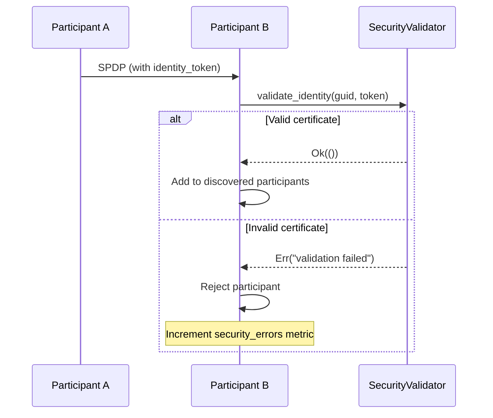
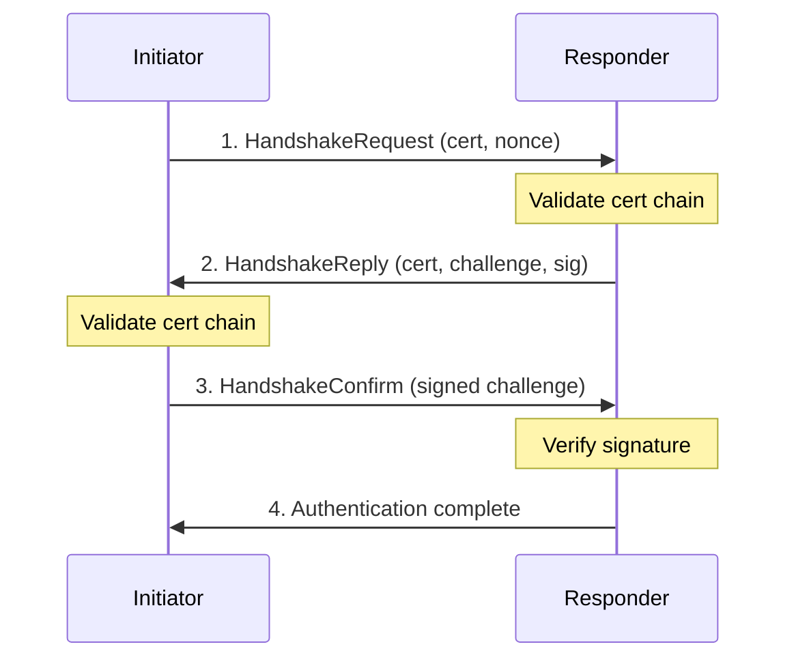

# Authentication

HDDS uses **X.509 PKI-DH** authentication to verify participant identity.

## Overview

Authentication ensures that:
- Participants have valid certificates signed by a trusted CA
- Participants prove possession of their private key
- Unauthorized participants cannot join the domain

## Certificate Requirements

### Supported Algorithms

| Type | Algorithm | Key Size |
|------|-----------|----------|
| RSA | PKCS#1 v2.1 | 2048-8192 bits |
| ECDSA | P-256 (secp256r1) | 256 bits |

### Certificate Extensions

- **KeyUsage**: Must include `digitalSignature`
- **Validity**: notBefore/notAfter checked at runtime
- **Subject**: Common Name (CN) used for identification

### File Format

All certificates and keys must be **PEM encoded**:

```
-----BEGIN CERTIFICATE-----
MIICxjCCAa6gAwIBAgIJALZ...
-----END CERTIFICATE-----
```

## Certificate Generation

### Using OpenSSL

#### Generate CA

```bash
# Generate CA private key
openssl genrsa -out ca_key.pem 2048

# Generate CA certificate (self-signed)
openssl req -x509 -new -nodes \
  -key ca_key.pem \
  -sha256 -days 1825 \
  -out ca_cert.pem \
  -subj "/CN=HDDS Root CA/O=MyOrg"
```

#### Generate Participant Certificate

```bash
# Generate participant private key
openssl genrsa -out participant_key.pem 2048

# Generate certificate signing request
openssl req -new \
  -key participant_key.pem \
  -out participant_csr.pem \
  -subj "/CN=SensorNode1/O=MyOrg"

# Sign with CA
openssl x509 -req \
  -in participant_csr.pem \
  -CA ca_cert.pem \
  -CAkey ca_key.pem \
  -CAcreateserial \
  -out participant_cert.pem \
  -days 365 \
  -sha256
```

#### Verify Certificate

```bash
# Verify certificate chain
openssl verify -CAfile ca_cert.pem participant_cert.pem
# Expected: participant_cert.pem: OK

# View certificate details
openssl x509 -in participant_cert.pem -text -noout
```

### Using ECDSA (P-256)

```bash
# Generate ECDSA CA key
openssl ecparam -genkey -name prime256v1 -out ca_key.pem

# Generate ECDSA participant key
openssl ecparam -genkey -name prime256v1 -out participant_key.pem
```

## Identity Token in Discovery

When security is enabled, participants announce their identity via the `identity_token` field in SPDP (Simple Participant Discovery Protocol) messages:

```rust
pub struct SpdpData {
    pub participant_guid: Guid,
    pub protocol_version: ProtocolVersion,
    pub vendor_id: VendorId,
    // ... other fields ...

    /// X.509 certificate for DDS Security authentication
    pub identity_token: Option<Vec<u8>>,
}
```

### Discovery Flow with Security



### Security Validation in DiscoveryFsm

The `DiscoveryFsm` uses a `SecurityValidator` trait to validate incoming participants:

```rust
pub trait SecurityValidator: Send + Sync {
    fn validate_identity(&self, guid: &Guid, token: &[u8]) -> Result<(), String>;
}

// Enable security validation
let validator: Arc<dyn SecurityValidator> = /* ... */;
discovery_fsm.set_security_validator(Some(validator));
```

Unauthenticated participants (those with no `identity_token` or invalid certificates) are rejected during SPDP processing, and the `security_errors` metric is incremented.

## Authentication Handshake

The 4-step challenge-response protocol:



### Handshake Details

1. **HandshakeRequest**: Initiator sends identity certificate and 32-byte random nonce
2. **HandshakeReply**: Responder validates certificate, sends own certificate and signed challenge
3. **HandshakeConfirm**: Initiator verifies responder, sends signed response
4. **Complete**: Both sides derive shared session key via ECDH

## Configuration

```rust
use hdds::{Participant, TransportMode};
use hdds::security::SecurityConfig;

let security = SecurityConfig::builder()
    // Required: Identity
    .identity_certificate("certs/participant.pem")
    .private_key("certs/participant_key.pem")

    // Required: Trust anchors
    .ca_certificates("certs/ca.pem")

    // Optional: Require all participants to authenticate
    .require_authentication(true)

    // Optional: Check certificate revocation (CRL/OCSP)
    .check_certificate_revocation(false)

    .build()?;
```

## Certificate Validation

HDDS performs these checks:

1. **Format validation**: Valid PEM structure
2. **Chain validation**: Traces to trusted CA
3. **Validity period**: Current time within notBefore/notAfter
4. **KeyUsage**: digitalSignature extension present
5. **Signature verification**: CA signature valid

### Validation Errors

| Error | Cause | Resolution |
|-------|-------|------------|
| `CertificateInvalid` | Malformed PEM | Regenerate certificate |
| `CertificateExpired` | Past notAfter date | Issue new certificate |
| `ChainValidationFailed` | No path to CA | Check CA in trust store |
| `SignatureInvalid` | Tampered certificate | Regenerate certificate |

## Unauthenticated Participants

By default, authenticated participants won't communicate with unauthenticated ones.

To allow mixed environments (not recommended):

```rust
let security = SecurityConfig::builder()
    .identity_certificate("cert.pem")
    .private_key("key.pem")
    .ca_certificates("ca.pem")
    .require_authentication(false)  // Allow unauthenticated
    .build()?;
```

## Multi-CA Environments

To trust multiple CAs, concatenate certificates:

```bash
cat ca1.pem ca2.pem > trusted_cas.pem
```

```rust
let security = SecurityConfig::builder()
    .ca_certificates("trusted_cas.pem")  // Multiple CAs
    // ...
    .build()?;
```

## Certificate Rotation

To rotate certificates without downtime:

1. Generate new certificate with overlapping validity
2. Update application configuration
3. Restart application
4. New handshakes use new certificate
5. Existing sessions continue with old key

## Best Practices

1. **Use strong keys**: RSA 2048+ or ECDSA P-256
2. **Short validity**: 90-365 days for participant certs
3. **Protect private keys**: Restrict file permissions (0600)
4. **Separate CA**: Dedicated, offline CA machine
5. **Rotate regularly**: Automate certificate renewal

## Troubleshooting

### Authentication Fails

```bash
# Enable debug logging
export RUST_LOG=hdds::security=debug
```

### Certificate Not Trusted

```bash
# Verify CA is correct
openssl verify -CAfile ca.pem participant.pem
```

### Key Mismatch

```bash
# Check key matches certificate
openssl x509 -noout -modulus -in cert.pem | md5sum
openssl rsa -noout -modulus -in key.pem | md5sum
# Hashes must match
```

## Next Steps

- [Access Control](../../guides/security/access-control.md) - Fine-grained permissions
- [Encryption](../../guides/security/encryption.md) - Data protection
