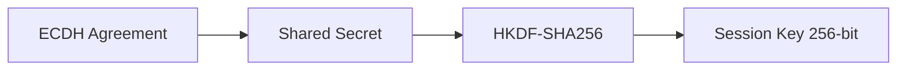

# Encryption

HDDS uses **AES-256-GCM** authenticated encryption for data protection.

## Overview

Encryption protects:
- **Confidentiality**: Data cannot be read by unauthorized parties
- **Integrity**: Data tampering is detected
- **Authenticity**: Data origin is verified

## Algorithm Details

| Property | Value |
|----------|-------|
| Cipher | AES-256-GCM |
| Key Size | 256 bits (32 bytes) |
| Nonce Size | 96 bits (12 bytes) |
| Auth Tag | 128 bits (16 bytes) |
| Hardware Accel | AES-NI (when available) |

## Configuration

```rust
use hdds::{Participant, TransportMode};
use hdds::security::SecurityConfig;

let security = SecurityConfig::builder()
    .identity_certificate("cert.pem")
    .private_key("key.pem")
    .ca_certificates("ca.pem")
    .enable_encryption(true)   // Enable AES-256-GCM
    .build()?;

let participant = Participant::builder("app")
    .domain_id(0)
    .with_transport(TransportMode::UdpMulticast)
    .security(security)
    .build()?;
```

## Key Exchange

Session keys are derived using ECDH + HKDF:



### Key Derivation

1. **ECDH**: Each participant generates ephemeral P-256 keypair
2. **Agreement**: Compute shared secret from peer's public key
3. **HKDF-Extract**: Derive pseudorandom key with salt
4. **HKDF-Expand**: Derive 256-bit session key with context info

```
ECDH shared secret (32 bytes)
    │
    ▼
HKDF-Extract (salt)
    │
    ▼
Pseudorandom Key (PRK)
    │
    ▼
HKDF-Expand (info: "DDS Security v1.1")
    │
    ▼
Session Key (32 bytes)
```

## Nonce Management

Each message uses a unique 96-bit nonce:

- **Generation**: Cryptographically random via `SystemRandom`
- **Uniqueness**: Never reused with same key
- **Collision probability**: ~2^-96 (negligible)

```rust
// Internal: Nonce generation per message
let nonce = SystemRandom::new().generate_nonce_96();
let ciphertext = aes_gcm_encrypt(&key, &nonce, &plaintext);
// Output: ciphertext || auth_tag (16 bytes)
```

## What Gets Encrypted

| Data | Encrypted | Notes |
|------|-----------|-------|
| User data payload | ✅ | Full encryption |
| RTPS submessage | ✅ | After authentication |
| Discovery (SPDP) | ❌ | Required for handshake |
| Discovery (SEDP) | ✅ | After authentication |
| Metadata headers | ❌ | Required for routing |

## Encryption Modes

### Per-Submessage Encryption

Each RTPS submessage is encrypted independently:

```
+-------------------+
| RTPS Header       |  <- Not encrypted (routing)
+-------------------+
| SEC_PREFIX        |  <- Crypto transform info
+-------------------+
| Encrypted DATA    |  <- AES-256-GCM ciphertext
+-------------------+
| SEC_POSTFIX       |  <- Authentication tag
+-------------------+
```

### Origin Authentication

GCM authentication tag verifies:
- Data was not modified in transit
- Data came from expected sender (via key binding)

## Performance

| Metric | Value |
|--------|-------|
| Encryption overhead | ~200 ns per message |
| Latency increase | ~80% vs unencrypted |
| Throughput | 625 MB/s |
| CPU at 50K msg/s | ~5% |

### Hardware Acceleration

HDDS uses the `ring` crate which leverages:
- **x86_64**: AES-NI instructions
- **ARM**: ARMv8 Crypto extensions
- **Fallback**: Software implementation

Check hardware support:
```bash
# x86_64
grep -o aes /proc/cpuinfo | head -1
# Output: aes (if supported)

# ARM
cat /proc/cpuinfo | grep Features | grep -o aes
```

## Ciphertext Format

```
+-------------------+-------------------+
| Ciphertext        | Authentication Tag |
| (len = plaintext) | (16 bytes)         |
+-------------------+-------------------+
```

Total overhead: 16 bytes per message (auth tag only, nonce transmitted separately in SEC_PREFIX)

## Key Rotation

Session keys can be rotated for forward secrecy:

1. New ephemeral keypair generated
2. New ECDH agreement
3. New session key derived
4. Old key securely erased

This ensures past traffic cannot be decrypted if current key is compromised.

## Audit Logging

When enabled, encryption events are logged:

```rust
let security = SecurityConfig::builder()
    // ...
    .enable_encryption(true)
    .enable_audit_log(true)  // Log crypto events
    .build()?;
```

Events logged:
- Key derivation (success/failure)
- Encryption operations
- Decryption failures (potential attack)

## Security Guarantees

### What Encryption Provides

- **Confidentiality**: Only intended recipients can read data
- **Integrity**: Any modification is detected
- **Replay protection**: Via sequence numbers and timestamps

### What Encryption Does NOT Provide

- **Traffic analysis protection**: Message timing/size visible
- **Denial of service protection**: Attackers can drop packets
- **Endpoint security**: Application must protect keys

## Troubleshooting

### Decryption Fails

```bash
# Enable crypto debug logging
export RUST_LOG=hdds::security::crypto=debug
```

Common causes:
- Key mismatch (check authentication)
- Corrupted ciphertext (network issue)
- Clock skew (check NTP)

### Performance Issues

If encryption is too slow:
1. Verify AES-NI is enabled (check CPU flags)
2. Consider message batching
3. Use larger messages (overhead is per-message)

## Best Practices

1. **Always enable encryption** for sensitive data
2. **Use authentication** - encryption without auth is meaningless
3. **Protect private keys** - encrypt at rest, restrict access
4. **Monitor failures** - decryption failures may indicate attacks
5. **Keep time synced** - use NTP for timestamp verification

## Next Steps

- [Access Control](../../guides/security/access-control.md) - Topic-level permissions
- [Authentication](../../guides/security/authentication.md) - Identity verification
