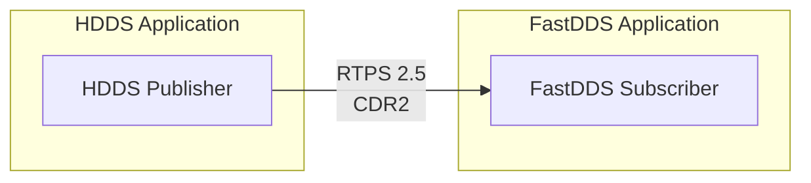

# Interoperability Guide

One of DDS's greatest strengths is **interoperability**. HDDS can communicate with other DDS implementations out of the box, thanks to the standardized RTPS wire protocol.

## Verified Interoperability (9/9 Scenarios)

HDDS has been tested and verified to interoperate with all major DDS implementations:

| Implementation | Version | Direction | Samples | Status |
|----------------|---------|-----------|---------|--------|
| **FastDDS** | 3.1.x | FastDDS → HDDS | 50/50 | ✅ |
| **FastDDS** | 3.1.x | HDDS → FastDDS | 50/50 | ✅ |
| **RTI Connext** | 6.1.0 | RTI → HDDS | 50/50 | ✅ |
| **RTI Connext** | 7.3.0 | RTI → HDDS | 49/50 | ✅ |
| **CycloneDDS** | 0.10.x | Cyclone → HDDS | 50/50 | ✅ |
| **CycloneDDS** | 0.10.x | HDDS → Cyclone | 50/50 | ✅ |
| **OpenDDS** | 3.28.x | OpenDDS → HDDS | 50/50 | ✅ |
| **OpenDDS** | 3.28.x | HDDS → OpenDDS | 50/50 | ✅ |
| **HDDS** | latest | HDDS → HDDS | 50/50 | ✅ |

### RTPS Protocol Versions

| Implementation | RTPS Version | Vendor ID |
|----------------|--------------|-----------|
| HDDS | 2.3 | 0x01aa |
| FastDDS | 2.3 | 0x010f |
| RTI Connext 6.x | 2.3 | 0x0101 |
| RTI Connext 7.x | **2.5** | 0x0101 |
| CycloneDDS | 2.3 | 0x0110 |
| OpenDDS | 2.3 | 0x0103 |

:::info RTI 7.x RTPS 2.5
RTI Connext 7.3.0 uses RTPS 2.5, which HDDS handles automatically without code changes.
:::

### Key Features Validated

| Feature | Tests | Status |
|---------|-------|--------|
| SPDP Discovery | 9/9 vendors | ✅ |
| SEDP Discovery | 9/9 vendors | ✅ |
| Reliable communication | All scenarios | ✅ |
| Best-Effort communication | All scenarios | ✅ |
| XCDR1 serialization | FastDDS, RTI, Cyclone | ✅ |
| XCDR2 serialization | All vendors | ✅ |
| Multi-node cluster | Cross-machine | ✅ |
| 96 QoS policy combinations | Validator suite | ✅ |

## How Interoperability Works

All compliant DDS implementations use the **RTPS** (Real-Time Publish Subscribe) protocol for communication. This means:

1. **Automatic Discovery** - Participants find each other via SPDP multicast
2. **Wire Compatibility** - Data is serialized using CDR2 format
3. **QoS Negotiation** - Compatible QoS policies are matched automatically



## Quick Start

To communicate between HDDS and another DDS implementation:

1. **Use the same Domain ID** (e.g., domain 0)
2. **Use the same Topic name** (e.g., "sensor/temperature")
3. **Use compatible data types** (same structure, generated from same IDL)
4. **Use compatible QoS** (e.g., both RELIABLE or both BEST_EFFORT)

### Example: HDDS Publisher → FastDDS Subscriber

**HDDS Publisher (Rust):**

```rust
let participant = Participant::builder("hdds_publisher")
    .domain_id(0)
    .with_transport(TransportMode::UdpMulticast)
    .build()?;
let topic = participant.create_topic::<Temperature>("sensor/temp")?;
let writer = participant.create_writer(&topic)?;

writer.write(&Temperature { sensor_id: "s1".into(), value: 23.5 })?;
```

**FastDDS Subscriber (C++):**

```cpp
auto participant = DomainParticipantFactory::get_instance()->create_participant(0, ...);
auto topic = participant->create_topic("sensor/temp", "Temperature", ...);
auto reader = subscriber->create_datareader(topic, ...);

// Will receive data from HDDS publisher
```

## Detailed Guides

- [FastDDS Interop](../interop/fastdds/setup.md) - Step-by-step FastDDS setup
- [RTI Connext Interop](../interop/rti-connext/setup.md) - RTI configuration
- [CycloneDDS Interop](../interop/cyclonedds/setup.md) - Eclipse CycloneDDS setup
- [QoS Translation Matrix](../interop/qos-translation-matrix.md) - QoS mapping between vendors

## Common Issues

### Type Mismatch

Ensure both sides use the same IDL definition:

```idl
// Both HDDS and FastDDS should use this exact IDL
struct Temperature {
    @key string sensor_id;
    float value;
};
```

### QoS Incompatibility

QoS policies must be compatible for matching:

| Writer QoS | Reader QoS | Result |
|------------|------------|--------|
| RELIABLE | RELIABLE | Match |
| RELIABLE | BEST_EFFORT | Match |
| BEST_EFFORT | RELIABLE | **No Match** |
| BEST_EFFORT | BEST_EFFORT | Match |

### Discovery Issues

If participants don't discover each other:

1. Check firewall settings (ports 7400-7500)
2. Verify multicast is enabled
3. Check domain IDs match
4. Use `hdds_viewer` to debug traffic
