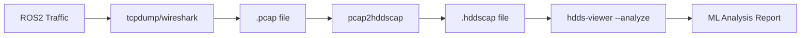

# Debugging ROS2 Traffic

HDDS provides powerful tools to capture, analyze, and debug ROS2 traffic using ML-powered anomaly detection.

## Pipeline Overview



## Step 1: Capture ROS2 Traffic

On your ROS2 machine, capture RTPS/DDS traffic:

```bash
# Capture all DDS traffic (ports 7400-7500)
sudo tcpdump -i any -w ros2_capture.pcap udp port 7400-7500
```

:::tip Duration
Run your ROS2 application while capturing. A few minutes of traffic is usually enough for analysis.
:::

### Capture Options

```bash
# Capture on specific interface
sudo tcpdump -i eth0 -w ros2_capture.pcap udp port 7400-7500

# Capture with timestamp precision
sudo tcpdump -i any -w ros2_capture.pcap --time-stamp-precision=nano udp port 7400-7500

# Limit capture size (100MB)
sudo tcpdump -i any -w ros2_capture.pcap -C 100 udp port 7400-7500
```

## Step 2: Convert to HDDSCAP Format

Convert the pcap file to HDDS's optimized capture format:

```bash
pcap2hddscap ros2_capture.pcap ros2_capture.hddscap
```

The converter extracts RTPS packets (the wire protocol underlying DDS/ROS2) and indexes them for fast analysis.

### Conversion Output

```
$ pcap2hddscap ros2_capture.pcap ros2_capture.hddscap

Processing: ros2_capture.pcap
  Packets read: 125,432
  RTPS packets: 98,201 (78.3%)
  Topics found: 12
  Participants: 4
  Duration: 45.2s

Output: ros2_capture.hddscap (12.4 MB)
```

## Step 3: ML-Powered Analysis

Run the ML analyzer to detect anomalies:

```bash
hdds-viewer --analyze ros2_capture.hddscap --format json
```

### Detected Anomaly Types

The ML model detects these issues automatically:

| Anomaly | Description | Typical Cause |
|---------|-------------|---------------|
| `network_congestion` | Network bandwidth saturation | Too many large messages, insufficient bandwidth |
| `deadline_violation` | QoS deadline not met | Publisher too slow, subscriber overloaded |
| `cascade_failure` | Chain reaction of node failures | Dependency failure, resource exhaustion |
| `cpu_saturation` | CPU overload affecting timing | Heavy computation, too many callbacks |
| `periodic_interference` | Periodic timing disruptions | Scheduler interference, GC pauses |

### Output Formats

```bash
# JSON output (for programmatic use)
hdds-viewer --analyze capture.hddscap --format json > report.json

# Markdown report (human-readable)
hdds-viewer --analyze capture.hddscap --format markdown > report.md

# Terminal output with colors
hdds-viewer --analyze capture.hddscap
```

### Example JSON Output

```json
{
  "summary": {
    "duration_sec": 45.2,
    "total_messages": 98201,
    "anomalies_detected": 3,
    "severity": "warning"
  },
  "anomalies": [
    {
      "type": "deadline_violation",
      "topic": "/camera/image",
      "timestamp": "2024-12-27T14:32:15.123Z",
      "details": {
        "expected_period_ms": 33,
        "actual_period_ms": 89,
        "violations": 12
      },
      "severity": "warning",
      "recommendation": "Check camera node CPU usage or reduce image resolution"
    },
    {
      "type": "network_congestion",
      "timestamp": "2024-12-27T14:32:45.456Z",
      "details": {
        "bandwidth_mbps": 95.2,
        "packet_loss_percent": 2.3
      },
      "severity": "error",
      "recommendation": "Reduce message frequency or enable compression"
    }
  ],
  "topics": [
    {
      "name": "/cmd_vel",
      "type": "geometry_msgs/msg/Twist",
      "frequency_hz": 50.1,
      "message_count": 2255
    },
    {
      "name": "/camera/image",
      "type": "sensor_msgs/msg/Image",
      "frequency_hz": 28.5,
      "message_count": 1287
    }
  ]
}
```

## Recognized ROS2 Topics

The ML model includes built-in recognition for common ROS2 topics:

### Navigation & Control
- `/cmd_vel` - Velocity commands
- `/odom` - Odometry
- `/tf` - Transform tree
- `/map` - Occupancy grid

### Sensors
- `/camera/image` - Camera images
- `/camera/depth` - Depth images
- `/imu/data` - IMU readings
- `/scan` - Laser scan
- `/gps/fix` - GPS position

### Planning
- `/goal_pose` - Navigation goals
- `/path` - Planned paths
- `/costmap` - Cost maps

## Interactive Analysis

For interactive debugging, launch hdds-viewer in GUI mode:

```bash
hdds-viewer ros2_capture.hddscap
```

This opens the visual analyzer with:
- **Timeline view** - Message flow over time
- **Topology graph** - Node connections
- **Message inspector** - Decode individual messages
- **Anomaly highlights** - Visual markers on issues

## Real-Time Capture (Advanced)

For live debugging without saving to file:

```bash
# Stream directly from tcpdump to analyzer
sudo tcpdump -i any -w - udp port 7400-7500 | \
    pcap2hddscap --stdin --stdout | \
    hdds-viewer --analyze --stdin
```

## Troubleshooting Common Issues

### No RTPS Packets Found

```bash
# Check if ROS2 is using the expected ports
ros2 doctor --report | grep -i dds

# Verify traffic exists
sudo tcpdump -i any udp port 7400-7500 -c 10
```

### Missing Topics

The capture might be too short. Ensure:
1. All ROS2 nodes are running during capture
2. Capture duration covers at least one full cycle of your application
3. Discovery has completed (wait ~5 seconds after node startup)

### High CPU During Analysis

For very large captures:

```bash
# Analyze a time window only
hdds-viewer --analyze capture.hddscap --start 10s --duration 30s
```

## Next Steps

- [hdds_viewer Documentation](https://viewer.hdds.io/docs) - Full tool documentation
- [ROS2 Performance Tuning](../ros2/performance.md) - Optimize based on findings
- [QoS Policies](../guides/qos-policies/overview.md) - Adjust QoS to fix issues
