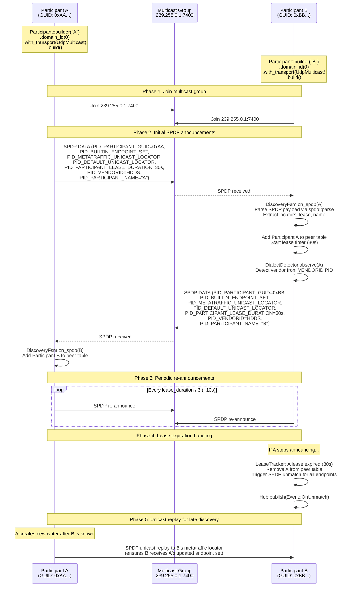
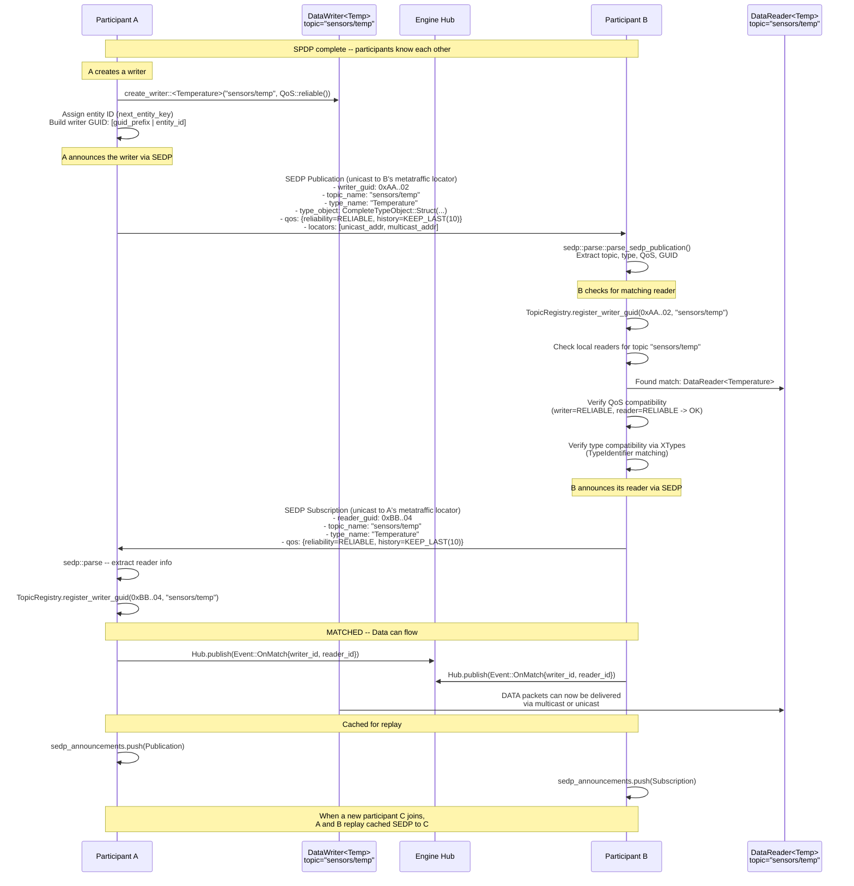
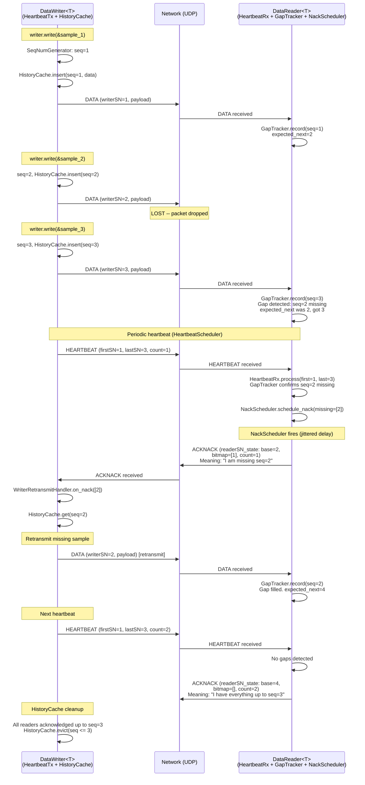
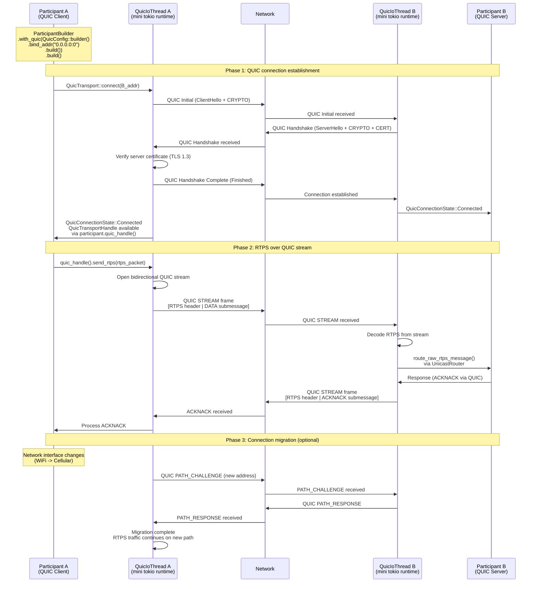
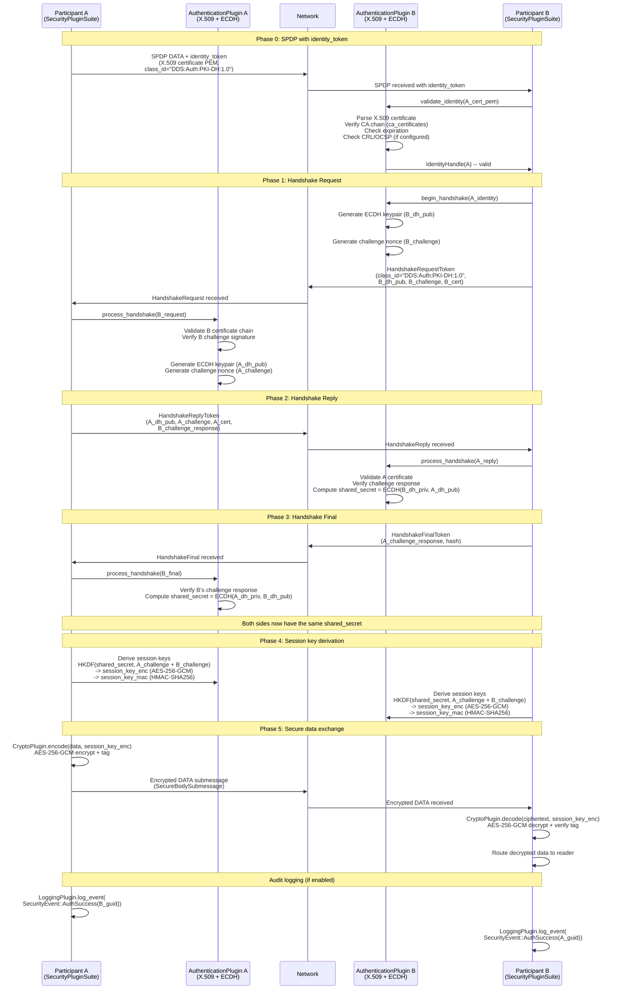
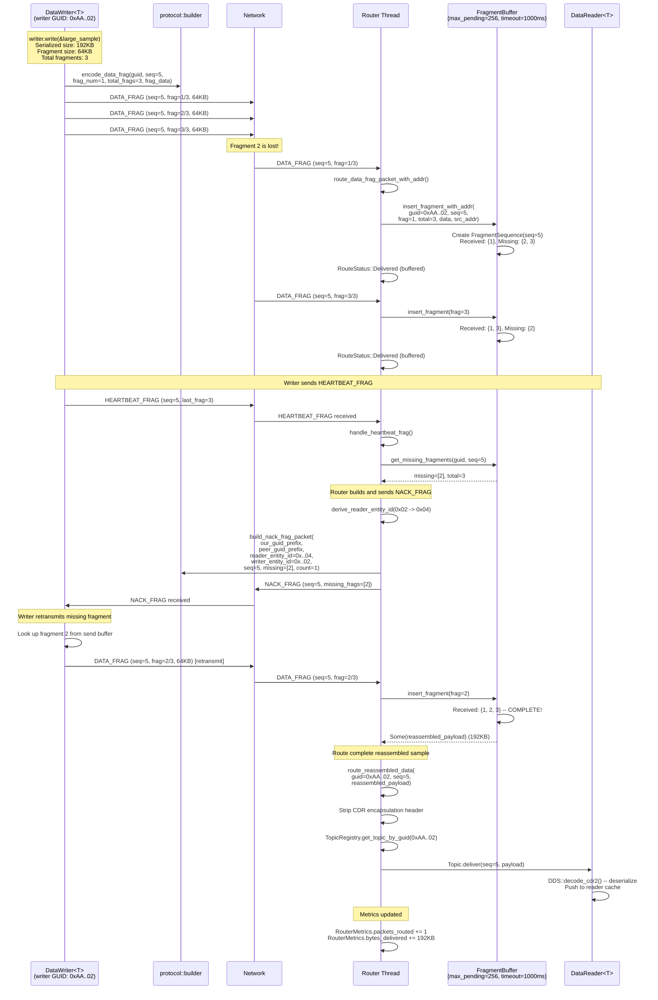
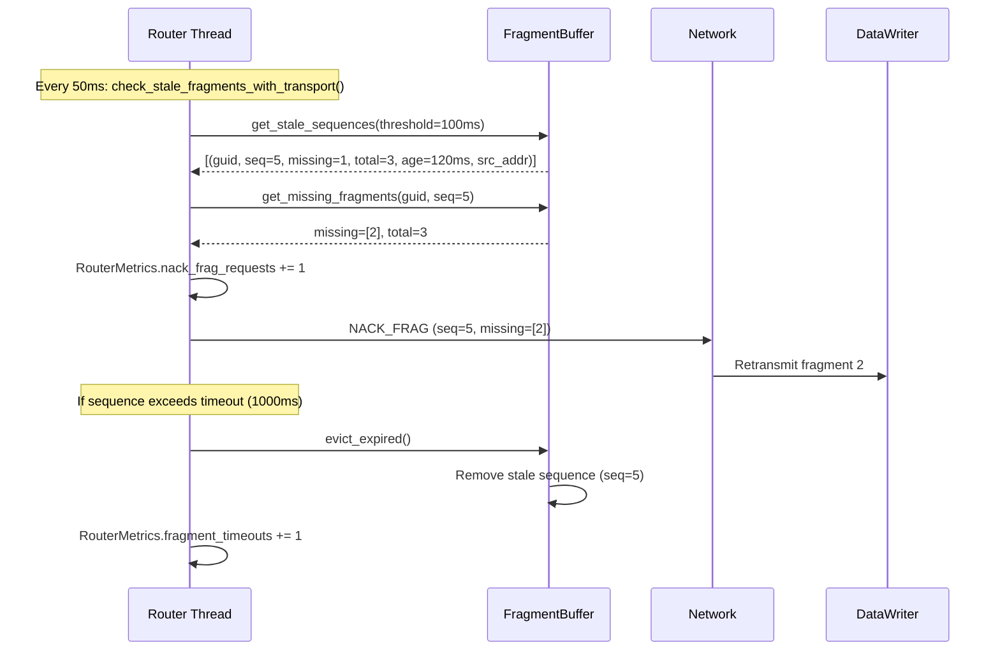
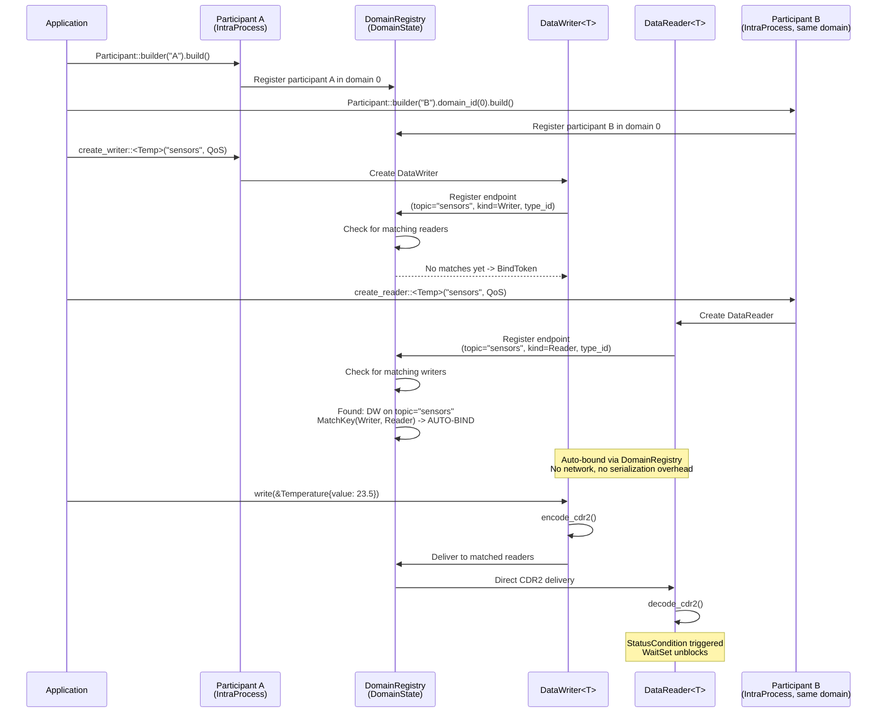
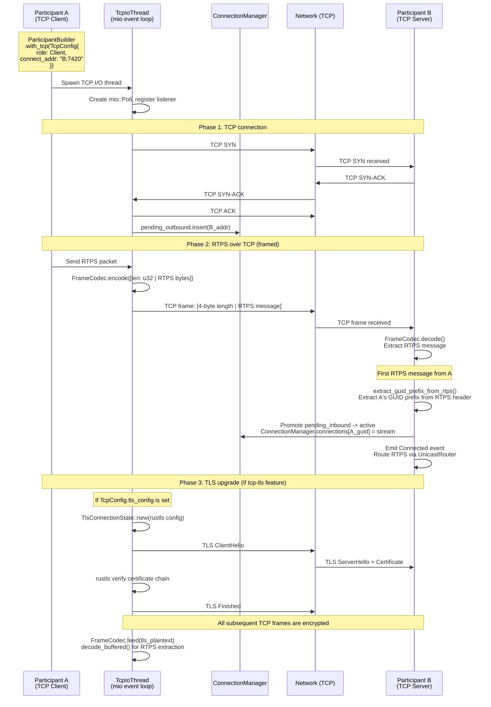

# HDDS Sequence Diagrams

> Version 1.0.5 | Last updated: 2026-02-13

Detailed Mermaid sequence diagrams for the core HDDS protocols.

---

## 1. Participant Discovery (SPDP)

The Simple Participant Discovery Protocol is the first phase of RTPS discovery.
All participants periodically multicast SPDP announcements to find each other.

Implementation: `crates/hdds/src/protocol/discovery/spdp/`

---

## 2. Endpoint Discovery (SEDP)

The Simple Endpoint Discovery Protocol follows SPDP. It announces DataWriter
and DataReader endpoints to enable topic matching.

Implementation: `crates/hdds/src/protocol/discovery/sedp/`

---

## 3. Reliable Data Exchange

The RTPS reliability protocol ensures all samples are delivered even with packet loss.

Implementation: `crates/hdds/src/reliability/`

---

## 4. QUIC Handshake + Data

HDDS supports QUIC transport for NAT traversal and connection migration.
Feature-gated behind the `quic` feature flag.

Implementation: `crates/hdds/src/transport/quic/`

---

## 5. Security Handshake

DDS Security v1.1 authentication exchange between two participants.
Feature-gated behind the `security` feature flag.

Implementation: `crates/hdds/src/security/auth/handshake.rs`

---

## 6. Fragmentation (DATA_FRAG)

Large messages that exceed the MTU are fragmented into multiple DATA_FRAG
submessages and reassembled on the reader side. HEARTBEAT_FRAG and NACK_FRAG
provide reliable fragment delivery.

Implementation:
- Sender: `crates/hdds/src/protocol/rtps/data.rs` (`encode_data_frag`)
- Receiver: `crates/hdds/src/engine/router.rs` (`route_data_frag_packet`)
- Fragment buffer: `crates/hdds/src/core/discovery/` (`FragmentBuffer`)
- NACK_FRAG: `crates/hdds/src/protocol/builder/nack_frag.rs`

### Timeout-Based NACK_FRAG (Backup Path)

If HEARTBEAT_FRAG is not received, the router's periodic stale-fragment check
provides a backup path for requesting retransmission.

---

## 7. Intra-Process Auto-Binding

When both writer and reader are in the same process, HDDS uses the
`DomainRegistry` to bypass network transport entirely.

Implementation: `crates/hdds/src/dds/domain_registry.rs`

---

## 8. TCP Connection Lifecycle

TCP transport for WAN environments where UDP multicast is blocked.

Implementation: `crates/hdds/src/transport/tcp/`

